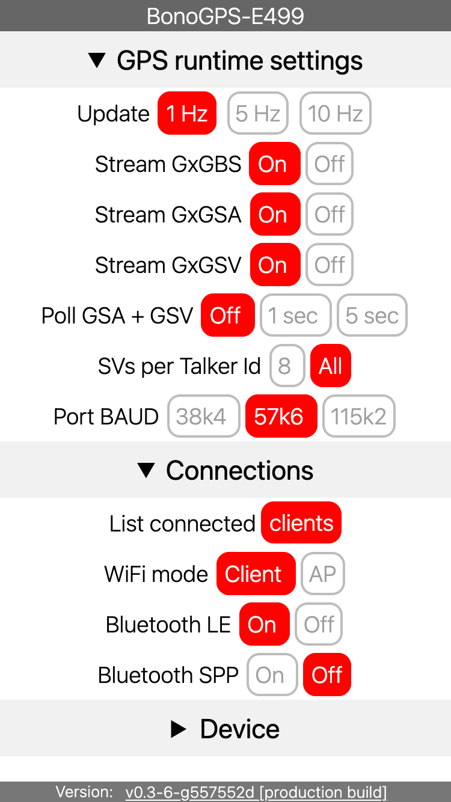

# BonoGPS

BonoGPS is a firmware for ESP32 devices that reads NMEA sentences from a ublox GPS device (for example commonly available and cheap [BN220](https://www.amazon.com/Navigation-Raspberry-Betaflight-Geekstory-Shipping/dp/B07PRDY6DS) and [BN880](https://www.amazon.com/Geekstory-Navigation-Raspberry-Aircraft-Controller/dp/B078Y6323W)) and repeats them back to either

1. a TCP/IP socket
2. a Bluetooth Low Energy (BLE) service
3. a BT Classic (BT-SPP) stream


The main goal is to **make GPS data available to mobile apps that can record data, for example for track riding**. Currently these apps are supported

1. [Harry's Lap Timer](https://www.gps-laptimer.de)
2. [TrackAddict](https://www.hptuners.com/product/trackaddict-app/)
3. [RaceChrono](https://racechrono.com/)

A web configuration (responsive HTML) panel allows changing select GPS parameters on the fly: access it via [http://bonogps.local]() (when in WiFi AP mode, this becomes [http://10.0.0.1]() on Android without mDNS resolution).

The settings required by each app are available as presets that you can load for your device (iOS, Android). More information on what version, features, and connections of each app are available below.

You can also interface your GPS to [uBlox u-center](https://www.u-blox.com/en/product/u-center) via TCP/IP, in this case be aware that the uart speed is fixed.

## Usage

1. Turn on the ESP32 and wait a few minutes for the GPS to get a fix on position (on BN devices, the red led will blink every second)
2. Open your preferred mobile app and connect 
3. Enjoy your ride!

Most runtime configurations are managed via the web-based interface



- **GPS runtime settings:** GPS messages, rate of updates, serial port speed
- **Connections:** List clients, enable BLE/BT-SPP connectivity, switch between WiFi client to a well-known WiFi network or built-in Access Point
- **Device:** Put GPS in powersaving for some time, load preset configurations, collect information about current status of the device, restart the ESP32, save current configuration, save WiFi credentials for client mode

The BOOT button allows you to switch between WiFi modes on the fly: WiFi client or WiFi Access Point.

- WiFi Client (WiFi STA): the led light flashes rapidly (250 ms cycle)
- WiFi Access Point (WiFi AP): the led light flashes slowly (500 ms cycle)

### Saving configuration

If you load a preset or if you change a runtime settings, you can preserve it across restart of the device.

Go to Device > Save Config and you'll find these options


For convenience, the WiFi status can be excluded or saved separately.

## Connecting to an app

There are many mobile apps to log lap times, few accept custom devices, in particular on iOS. The ones below are tested.

| | [Harry Lap Timer](configuring/harrylaptimer) | [TrackAddict](configuring/trackaddict) | [RaceChrono](configuring/racechrono) |
| --- | --- | --- | --- |
| iOS | **BLE**, TCP-IP | | |
| Android | **BT-SPP**, TCP-IP | BT-SPP | BT-SPP |


## Hardware build instructions

You only need to connect your ublox GPS module to a Hardware serial port such as UART2/Serial2 and the GPS power to the Vin and Ground pins of ESP32.

Schematics are relatively simple

* power the GPS module
* connect GPS RX to ESP32 UART2 TX and GPS TX to ESP32 UART2 RX


### GPS Preconfiguration

To reduce complexity of this software, you need to save a baseline configuration of your ublox GPS module. Parameters include

- default port speed (it must match GPS_STANDARD_BAUD_RATE)
- what satellite systems to use (for US, GPS/Glonass/Galileo)
- what Wide Area Augmentation System to be used
- disable all unnecessary NMEA messages
- set motion defaults

... etc.

A backup of the options is in the [hardware/GPS folder](hardware/GPS/gps-bn220-config.txt), stored for a BN-220 but it's identical to a BN-880


## Software build instructions

This code is developed specifically for ESP32, and tested with [PlatformIO](https://platformio.org/) (main development platform) and the [Arduino IDE (1.8.13)](https://www.arduino.cc/en/software)

### Libraries
  - [Nimble-Arduino](https://github.com/h2zero/NimBLE-Arduino) 
  - [Uptime Library](https://github.com/YiannisBourkelis/Uptime-Library) 
  - [EasyButton](https://easybtn.earias.me/) 

### Optional libraries depending on #define options
  - [Task Scheduler](https://github.com/arkhipenko/TaskScheduler)  [included by default]
  - [NeoGPS](https://github.com/SlashDevin/NeoGPS)  [not included right now, but coded and available for some additional cases]

### Built-in libraries used by this code
  - WebServer
  - FS
  - Preferences
  - WiFi
  - DNSServer
  - ESPmDNS
  - ArduinoOTA
  - Update
  - BluetoothSerial 

### Important: Partition size

You have to select a partitioning schema with 1.7 Mb of programming space (e.g. Minimal SPIFF with 1.9Mb), as the app with its libraries tend to be pretty large due to BT stacks.

Within PlatformIO, use the [platformio.ini](platformio.ini) available configuration

```
board_build.partitions = min_spiffs.csv
```

Within the Arduino IDE, from `Tools > Partition Scheme`


## Possible enhancements and ideas
   
  - add display: https://randomnerdtutorials.com/esp32-ssd1306-oled-display-arduino-ide/
  - add battery and expose battery level via BLE and/or web interface
  - log to SD  https://randomnerdtutorials.com/esp32-data-logging-temperature-to-microsd-card/
  - test https://apps.apple.com/us/app/espressif-esptouch/id1071176700 or https://apps.apple.com/in/app/esp-ble-provisioning/id1473590141
  - OTA via browser or from internet location https://lastminuteengineers.com/esp32-ota-web-updater-arduino-ide/ https://github.com/chrisjoyce911/esp32FOTA or https://github.com/platformio/bintray-secure-ota
  - use ootb library at https://os.mbed.com/teams/ublox/code/gnss/ or https://github.com/ldab/u-blox_GNSS
  - use packed binary format with custom binary parser for HLT
  - use https with https://github.com/fhessel/esp32_https_server and https://github.com/fhessel/esp32_https_server_compat
  - restore usage of https://github.com/khoih-prog/ESPAsync_WiFiManager and Async webserver (issues with ASyncTCP not being able to send info back outside of request/reply

