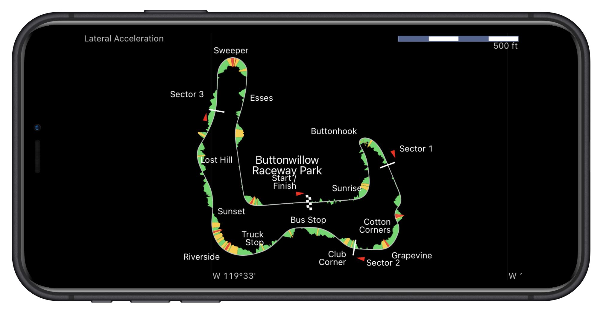
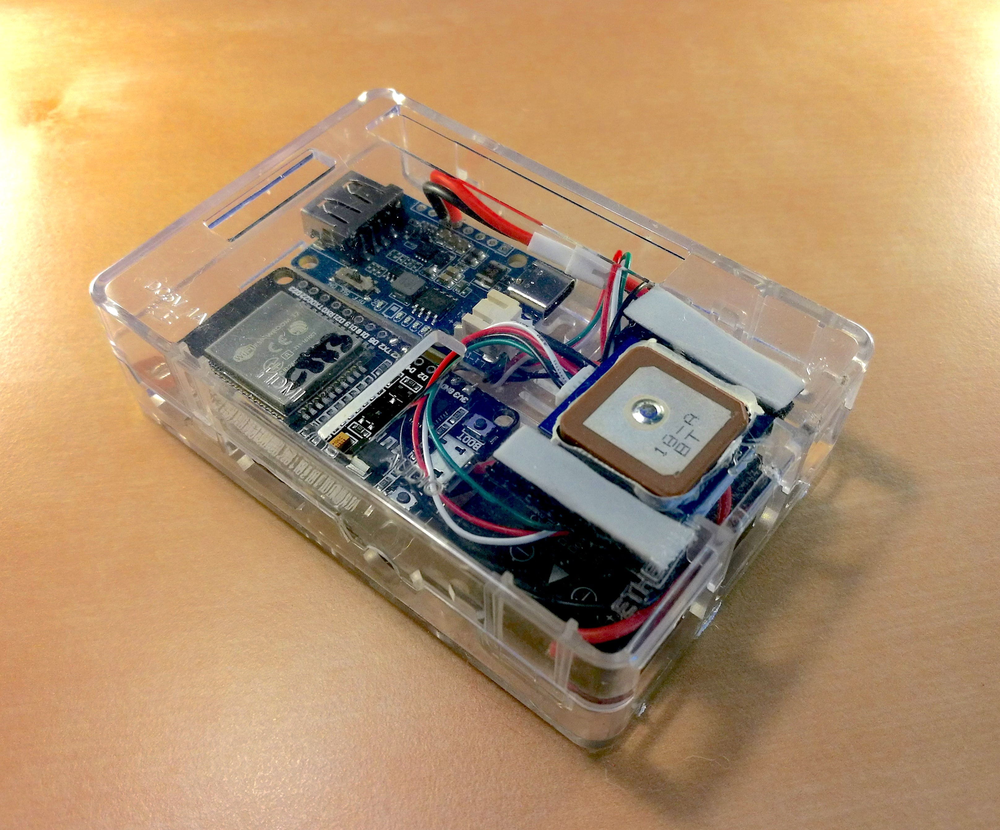
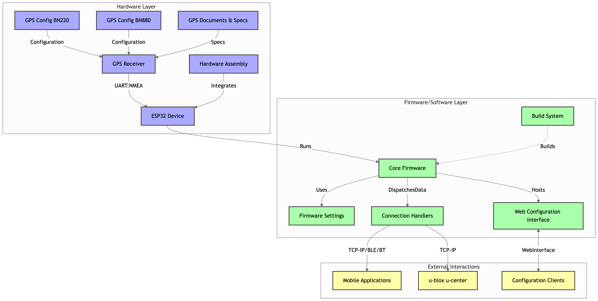
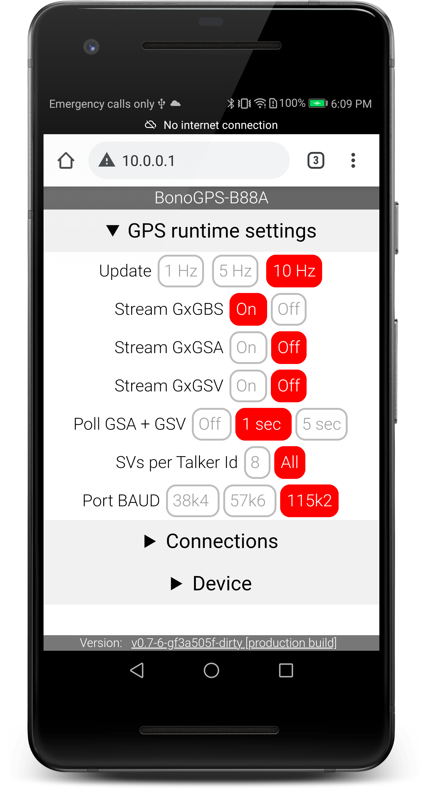
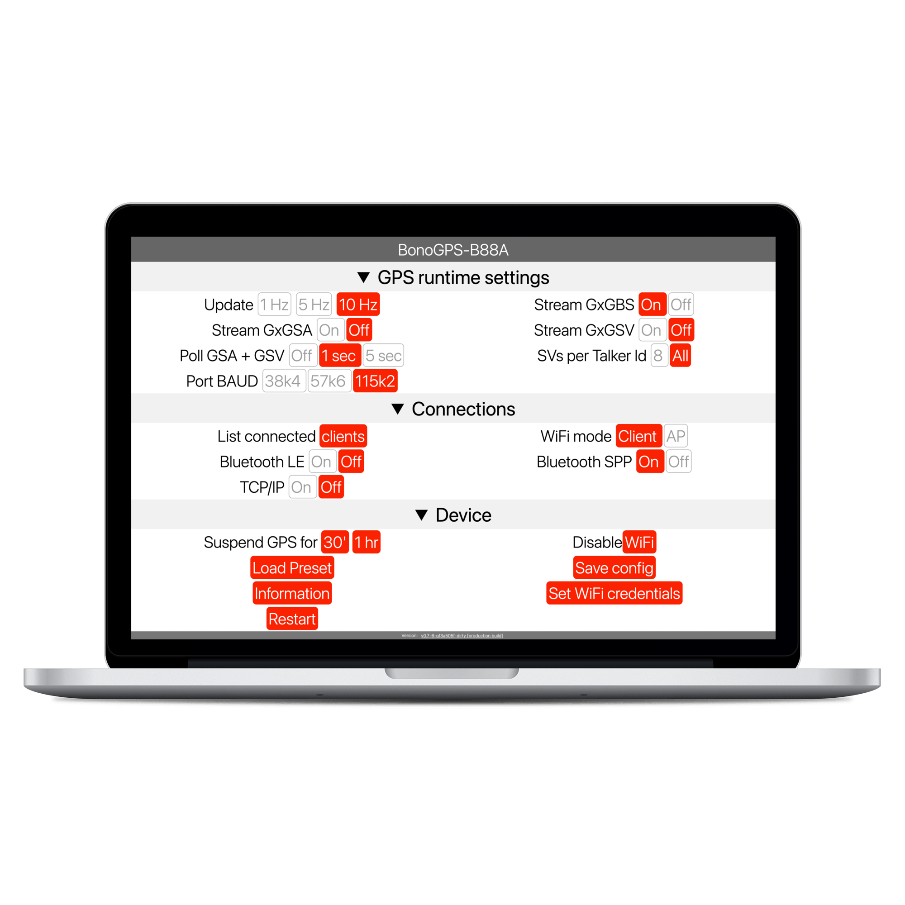
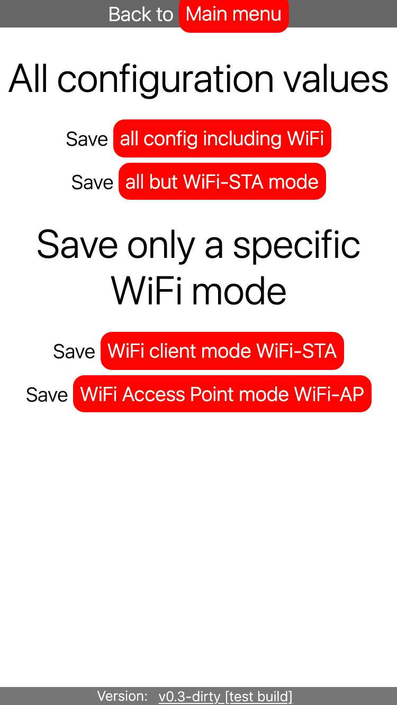
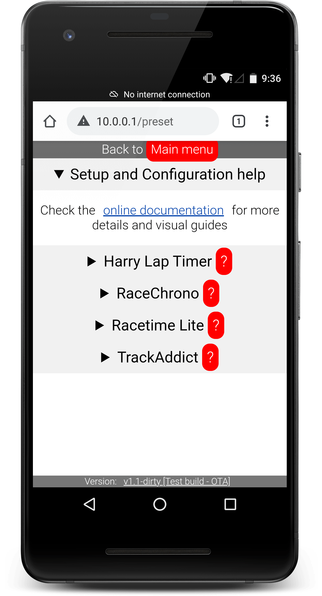
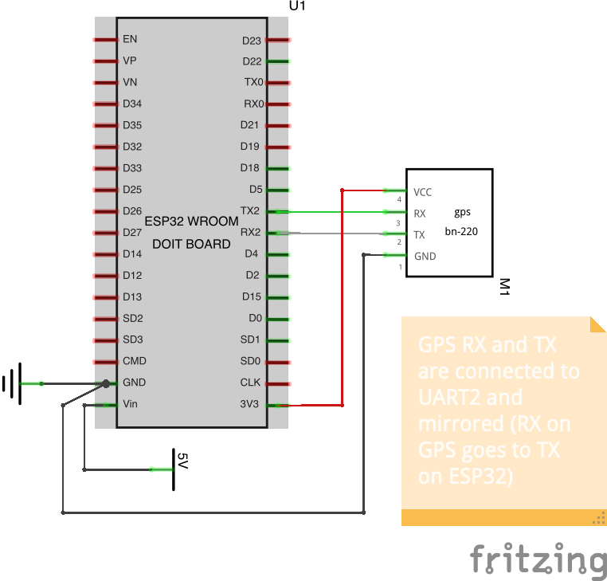

# What is BonoGPS?

- [What is BonoGPS?](#what-is-bonogps)
  - [For the track day enthusiast](#for-the-track-day-enthusiast)
  - [For the SW Engineer / maker](#for-the-sw-engineer--maker)
    - [Diagram of project components](#diagram-of-project-components)
  - [Quick Start Guide](#quick-start-guide)
  - [HowTo](#howto)
    - [Daily Usage](#daily-usage)
      - [Save a configuration](#save-a-configuration)
    - [Connecting to an app](#connecting-to-an-app)
  - [Hardware build instructions](#hardware-build-instructions)
    - [GPS Choice and setup preconfiguration](#gps-choice-and-setup-preconfiguration)
  - [Software build instructions](#software-build-instructions)
  - [Technical Specifications](#technical-specifications)
  - [Troubleshooting and FAQ](#troubleshooting-and-faq)
  - [Possible enhancements and ideas](#possible-enhancements-and-ideas)
  - [Credits and tools](#credits-and-tools)

## For the track day enthusiast

The main goal of this device is to **make GPS data (speed, location) available to mobile apps that can record data up to 25 Hz, for example for track riding**. While there are many good (and not even too expensive) solutions out there, building one for yourself is a great experience.

Currently these apps are supported

1. [Harry's Lap Timer](https://www.gps-laptimer.de) >> details [here](software/connecting/harrylaptimer)
2. [TrackAddict](https://www.hptuners.com/product/trackaddict-app/) >> details [here](software/connecting/trackaddict)
3. [RaceChrono](https://racechrono.com/) >> details [here](software/connecting/racechrono)
4. [RaceTime](https://www.racetimeapp.com/en/) >> details [here](software/connecting/racetime)

If you are not into the maker thing or if you don't know anyone who might be, [look into RaceBox products like mini/miniS](https://www.racebox.pro/) and even [a 25Hz kit](https://www.racebox.pro/products/racebox-micro), or [a XGPS160](https://gps.dualav.com/explore-by-product/xgps160).

## For the SW Engineer / maker

This repo contains software, a list of hardware, and (simple) schematics to build an ESP32 device that reads NMEA sentences from a GPS receiver compatible with u-blox M10 and M8 series, for example:

| GPS Module | Chipset | Max Refresh | Antenna Type | Recommended | Link |
| ---------- | ------- | ----------- | ------------ | ----------- | ---- |
| **BK880** | M10 | **25 Hz** | Active | ✓ Best | [Store](https://store.beitian.com/products/beitian-compass-qmc5883l-amp2-6-pix4-pixhawk-gnss-gps-glonass-dual-flight-control-gps-module-bn-880q?variant=44977758011679) |
| **BK280** | M10 | **25 Hz** | Passive | ✓ Best | [Store](https://store.beitian.com/collections/gps-module/products/beitian-gps-module-with-antenna-ubx-m10050-gnss-chip-ultra-low-power-gnss-receiver-for-track-be-180?variant=44859232420127) |
| BN880 | M8 | 10 Hz | Active | Good | [Store](https://store.beitian.com/products/beitian-ubx-m8030-g-mouse-supports-gps-qzss-and-sbas-fixed-wing-traversing-aircraft-gps-module-antenna-bn-180-220-280-357-880-880q?variant=46725104730399&_pos=1&_sid=fe8b2c602&_ss=r) |
| BN220 | M8 | 10 Hz | Passive | Budget | [Store](https://store.beitian.com/products/beitian-ubx-m8030-g-mouse-supports-gps-qzss-and-sbas-fixed-wing-traversing-aircraft-gps-module-antenna-bn-180-220-280-357-880-880q?variant=46694929989919&_pos=1&_sid=fe8b2c602&_ss=r) |
| DIYmall NEO-M8N | M8N | 10 Hz | Active | Compatible | [Amazon](https://www.amazon.com/DIYmall-NEO-M8N-Module-HMC5983-Antenna/dp/B012RNLG0K) |

**Note:** Active antennas provide better signal quality. M10 modules (BK880/BK280) offer 25Hz refresh rate which is ideal for track use. See [GPS setup guide](hardware/GPS) for detailed configuration.

and repeats them back to a logger device, either

1. a Bluetooth Low Energy (BLE) service
2. a BT Classic (BT-SPP) stream
3. a TCP-IP socket

The logger device is likely going to be one of the *Track Lap time apps* listed above running on your phone.

Examples of actual devices are in [hardware/assembled](hardware/assembled), at a cost of 25$ and 40$ (GPS receivers with active antennas are a little bit more expensive but worth it, and a larger battery helps as well)

A web configuration (basic responsive HTML) panel allows changing configuration and selecting GPS parameters on the fly: access it via [http://bonogps.local](http://bonogps.local) (when in WiFi AP mode, this becomes [http://10.0.0.1](http://10.0.0.1) on Android without mDNS resolution).

The settings required by each app are available as presets that you can load for your device (iOS, Android). More information on what version, features, and connections of each app are in [software/connecting](software/connecting).

You can also interface your GPS to [uBlox u-center](https://www.u-blox.com/en/product/u-center) via TCP-IP. In this case, be aware that the UART speed is fixed.

### Diagram of project components

## Quick Start Guide

**New to BonoGPS? Get started in 5 steps:**

### Step 1: Get the Hardware (Budget: $30-60)

**Minimum setup (~$30):**
- ESP32 DevKit board (~$8-12) - [Amazon](https://www.amazon.com/s?k=esp32+devkit)
- BN220 GPS module (~$15-20) - [Beitian Store](https://store.beitian.com/)
- USB cable for programming/power
- Basic jumper wires

**Recommended setup (~$45):**
- ESP32 DevKit or LOLIN D32 PRO (~$12-20)
- BN880 GPS with active antenna (~$25) - [Beitian Store](https://store.beitian.com/)
- Li-Ion battery (650-2000mAh, ~$5-10)
- Case or 3D printed enclosure

**Best performance (~$60):**
- LOLIN D32 PRO with built-in battery charger (~$15-20)
- BK880 or BK280 GPS (M10, 25Hz) (~$35-45) - [Beitian Store](https://store.beitian.com/)
- 2000mAh Li-Ion battery (~$8-12)
- Custom 3D printed mount

### Step 2: Wire It Up (15 minutes)

Connect GPS to ESP32 - only 4 wires needed:
- GPS **VCC** → ESP32 **3.3V** (power)
- GPS **GND** → ESP32 **GND** (ground)
- GPS **TX** → ESP32 **RX** (GPIO 16 on DevKit, GPIO 4 on LOLIN D32 PRO)
- GPS **RX** → ESP32 **TX** (GPIO 17 on DevKit, GPIO 2 on LOLIN D32 PRO)

See detailed wiring diagrams: [Generic ESP32](hardware/esp32) | [LOLIN D32 PRO](hardware/esp32/lolin_d32_pro.md)

### Step 3: Configure GPS Module (30 minutes)

**Critical:** GPS must be configured before first use.

1. Download [u-blox u-center](https://www.u-blox.com/en/product/u-center)
2. Connect GPS to computer via USB-to-serial adapter
3. Follow the [GPS configuration guide](hardware/GPS)
4. Set baudrate to **115200**
5. Enable required NMEA messages
6. Save configuration to GPS flash memory

### Step 4: Build and Upload Software (20-45 minutes)

**Option A: Arduino IDE (easier for beginners)**
1. Install [Arduino IDE 2.x](https://www.arduino.cc/en/software)
2. Add ESP32 board support
3. Install required libraries (see [library list](software/building#external-libraries))
4. Open `bonogps.ino`
5. Select "ESP32 Dev Module" or "LOLIN D32 PRO"
6. Select "Minimal SPIFFS (1.9MB)" partition scheme
7. Upload to ESP32

**Option B: PlatformIO (recommended for developers)**
1. Install [VS Code + PlatformIO](https://platformio.org/install/ide?install=vscode)
2. Clone this repository: `git clone https://github.com/renatobo/bonogps.git`
3. Open project folder in VS Code
4. Select build target for your board
5. Build and upload

See detailed instructions: [Software build guide](software/building)

### Step 5: Connect to Your App (10 minutes)

1. Power on BonoGPS - wait for GPS fix (LED blinks once/second)
2. Connect phone to **BonoGPS-XXXX** WiFi network
3. Open browser to [http://10.0.0.1](http://10.0.0.1)
4. Go to **Device > Load Preset** - select your app and platform
5. Enable appropriate connection (BLE/BT-SPP/TCP-IP)
6. Open your lap timer app and connect

**Supported apps:** [Harry's Lap Timer](software/connecting/harrylaptimer) | [TrackAddict](software/connecting/trackaddict) | [RaceChrono](software/connecting/racechrono) | [RaceTime](software/connecting/racetime)

**Need help?** See [Troubleshooting FAQ](#troubleshooting-and-faq) below.

---

## HowTo

### Daily Usage

1. Turn on the ESP32 and wait a few minutes for the GPS to get a fix on position (on BN devices, the red led will blink every second)
2. Open your preferred mobile app and connect it to your BonoGPS-*ABCD* device (ABCD is a combination of 4 letters and numbers unique to your ESP32 device)
3. Enjoy your ride!

Most runtime configurations are managed via its web-based interface: you can use your phone or any device with a web browser which is able to connect to either the built-in Access Point the BonoGPS provides or (if you are home and you have configured the WiFi Client credentials) [http://bonogps.local](http://bonogps.local)

The local built-in access point will be named BonoGPS-*ABCD* device (ABCD is a combination of 4 letters and numbers unique to your ESP32 device) and the password to it is in the source code (you can change it to your discretion - it's simply meant to avoid anyone connecting by mistake)

- **GPS runtime settings:** GPS messages, rate of updates, serial port speed
- **Connections:** List clients, enable BLE/BT-SPP connectivity, enable/disable the builtin TCP-IP messages repeater, switch between WiFi client to a well-known WiFi network or built-in Access Point
- **Device:** Put GPS in powersaving for some time, Disable WiFi, load preset configurations, save current configuration, collect information about current status of the device, save WiFi credentials for client mode restart the ESP32

The BOOT button (or another button of your choice) allows you to loop between WiFi modes on the fly:

- short press: toggle between WiFi Access Point (built in led, usually blue, slowly blinking 500 ms cycle) and no WiFi (built in led off)
- long press (at least 2 seconds): enable WiFi Client so that you can reach the unit from your preferred WiFi network (internal led/blue led light flashes rapidly with a 250 ms cycle)

#### Save a configuration

If you load a preset or if you change a runtime settings, you can preserve it across restart of the device.

Go to *Device > Save Config* and you'll find these options

For convenience, the WiFi status (Start its own AP, or connect to a local WiFi) can be excluded or saved separately.

### Connecting to an app

There are many mobile apps to log lap times, few accept custom devices, in particular on iOS. The ones below are tested.

| App | Platform | Connection | Max Refresh | Tested Version | Setup Guide |
| --- | -------- | ---------- | ----------- | -------------- | ----------- |
| [Harry's Lap Timer](https://www.gps-laptimer.de) | iOS | **BLE** (recommended), TCP-IP | 20Hz (BLE) | v24.9.1 | [Guide](software/connecting/harrylaptimer) |
| [Harry's Lap Timer](https://www.gps-laptimer.de) | Android | **BT-SPP** (recommended), TCP-IP | 10Hz | v24.9.1 | [Guide](software/connecting/harrylaptimer) |
| [TrackAddict](https://www.hptuners.com/product/trackaddict-app/) | Android | BT-SPP | 10Hz | v4.6.0 | [Guide](software/connecting/trackaddict) |
| [RaceChrono](https://racechrono.com/) | iOS | TCP-IP | 10Hz | v7.0.10 | [Guide](software/connecting/racechrono) |
| [RaceChrono](https://racechrono.com/) | Android | BT-SPP | 10Hz | v7.0.10 | [Guide](software/connecting/racechrono) |
| [RaceTime](https://www.racetimeapp.com/en/) | Android | BT-SPP | 10Hz | v3.3.8 lite | [Guide](software/connecting/racetime) |

**Note:** Recommended connection methods are shown in **bold**. See detailed setup instructions in each guide.

You can load a preset configuration from the configuration page selecting *Device > Load Preset* and then choosing your mobile phone device and app combination (when there are alternatives, the recommended option is in bold)

## Hardware build instructions

**⏱️ Time:** 30-60 minutes | **🎯 Difficulty:** Beginner (basic soldering skills helpful)

The minimum build is a ublox M8 series GPS receiver module connected to an ESP32:

- TX/RX from the GPS to a serial port (default in the code is UART2/Serial2) on ESP32. Remember: you need to connect RX on one device to TX on the other and viceversa
- the GPS power pins to ESP32: VCC to 3v3, GND to GND

BN220 comes with a 4 pin adapter cable for GND TX RX VCC, while BN880 includes 2 additionals pins for SDA and SCL of the IMU which are not used so you should leave them unconnected.

Schematics are relatively simple

- power the GPS module (3.3V on ESP32 to VCC on GPS receiver, GND on ESP32 to GND on GPS receiver)
- connect GPS RX to ESP32 UART2 TX and GPS TX to ESP32 UART2 RX (RX and TX are switched: GPS transmits, ESP32 receives)

Examples are in [hardware/assembled](hardware/assembled) including an example with more options using an ESP32 device type Lolin D32 Pro which has an internal battery charger [hardware/esp32/lolin_d32_pro.md](hardware/esp32/lolin_d32_pro.md)

**See also:**
- [GPS Configuration Guide](hardware/GPS) - Configure GPS before use
- [Assembly Troubleshooting](hardware/assembled#hardware-assembly-troubleshooting) - Common wiring issues
- [LOLIN D32 PRO Specific Guide](hardware/esp32/lolin_d32_pro.md) - Battery charging setup

### GPS Choice and setup preconfiguration

**⏱️ Time:** 30-45 minutes | **🎯 Difficulty:** Intermediate | **Prerequisites:** USB-to-serial adapter, u-center software

Thanks to needs of a very active drone community, there are a lot of inexpensive GPS receivers: some considerations on performance/accuracy/cost are reported [in the hardware/GPS folder](hardware/GPS).

What you need to configure is documented [in the hardware/GPS folder](hardware/GPS): this is **important**, the performances of your GPS won't be optimal until you do, or the whole setup will not work at all.

**See also:**
- [GPS Module Comparison](hardware/GPS#performance-comparison) - Detailed specs for each module
- [GPS Troubleshooting](hardware/GPS#gps-hardware-troubleshooting) - Module-specific issues
- [u-blox u-center Guide](hardware/GPS) - Configuration software instructions

## Software build instructions

**⏱️ Time:** 20-45 minutes (Arduino IDE: 20-30 min, PlatformIO: 30-45 min first time) | **🎯 Difficulty:** Beginner to Intermediate | **Prerequisites:** Arduino IDE or VS Code with PlatformIO, USB cable

This code is developed specifically for ESP32, and tested with [PlatformIO](https://platformio.org/) (main development platform) and the [Arduino IDE version 2 (2.3.4)](https://www.arduino.cc/en/software). More information on what libraries are needed and software organization [in the software/building folder](software/building).

**See also:**
- [Build Troubleshooting](software/building#build-troubleshooting) - Library versions, compilation errors
- [Board Settings](include/README.md) - Pin definitions and configurations
- [Connecting to Apps](software/connecting) - After successful build

## Technical Specifications

### Performance Expectations

**GPS Accuracy:**
- **Horizontal position:** 2-3 meters (6-10 feet) typical with M8/M10 chipsets
- **Speed accuracy:** ±0.1 km/h at constant velocity
- **Update rates:** 10Hz (M8 modules), 25Hz (M10 modules)
- **Cold start time:** 5-15 minutes (first power-on)
- **Hot start time:** 1-5 seconds (after recent fix)
- **Signal quality:** C/N0 values typically 30-40 dBHz (higher is better)

**Power Consumption:**
- **ESP32:** 80-160mA (varies with WiFi/Bluetooth activity)
- **GPS module:** 30-80mA (depends on module and fix status)
- **LED indicators:** 10-40mA
- **Total typical:** 250-350mA average during operation
- **Peak consumption:** Up to 500mA when WiFi and GPS are both active

**Battery Life Examples:**
- 650mAh battery: ~2-2.5 hours runtime
- 1000mAh battery: ~3-4 hours runtime
- 2000mAh battery: ~6-8 hours runtime (full track day)

**Note:** Actual battery life depends on WiFi/Bluetooth usage, GPS update rate, and environmental conditions.

### Connectivity Specifications

**WiFi:**
- **Standard:** 802.11 b/g/n (2.4 GHz only)
- **Range:** ~30-50 meters open air (depends on environment)
- **Access Point mode:** Supports up to 4 simultaneous clients
- **TCP server port:** 1818 (configurable)
- **mDNS hostname:** bonogps.local

**Bluetooth Low Energy (BLE):**
- **Standard:** Bluetooth 4.2 / 5.0 (depends on ESP32 module)
- **Range:** ~10-30 meters typical
- **Service UUID:** 1819 (Location and Navigation Service)
- **Max throughput:** ~20Hz GPS data with minimal satellite info
- **iOS support:** Full (recommended connection method)

**Bluetooth Classic (BT-SPP):**
- **Standard:** Bluetooth 2.0 SPP (Serial Port Profile)
- **Range:** ~10-30 meters typical
- **Baudrate:** 115200 (matches GPS UART)
- **Max throughput:** ~10Hz GPS data with satellite info
- **Android support:** Full (recommended connection method)

### Build Size and Memory

**Flash Memory Usage:**
- **With BLE + BT-SPP:** ~1.5-1.7 MB (requires Minimal SPIFFS partition)
- **With BLE only:** ~1.3-1.4 MB
- **With BT-SPP only:** ~1.2-1.3 MB
- **Minimum partition:** 1.9 MB app space required

**RAM Usage:**
- **ESP32 SRAM:** ~120-180 KB used (out of 320 KB available)
- **PSRAM:** Optional, helps with stability if available (LOLIN D32 PRO has 4MB)

**SPIFFS Storage:**
- **Configuration files:** ~2-4 KB
- **Reserved space:** 190 KB (with Minimal SPIFFS partition)

### Supported NMEA Messages

**Standard output messages:**
- `GxGGA` - Global Positioning System Fix Data
- `GxRMC` - Recommended Minimum Specific GPS Data
- `GxGBS` - GNSS Satellite Fault Detection (accuracy estimates)
- `GxGSA` - GPS DOP and Active Satellites (optional, polled)
- `GxGSV` - GPS Satellites in View (optional, polled)
- `GxVTG` - Track Made Good and Ground Speed
- `GxZDA` - Time and Date

**Talker ID support:**
- `GN` - Multi-constellation GNSS (GPS+GLONASS+Galileo+BeiDou)
- `GP` - GPS only (required by some apps like RaceChrono)

**Message rates:** Configurable from 1Hz to 25Hz (hardware dependent)

### Environmental Specifications

**Operating conditions:**
- **Temperature:** -20°C to +70°C (-4°F to 158°F) typical
- **Note:** Li-Ion batteries should not be charged below 0°C (32°F)
- **Humidity:** Most ESP32 boards are not waterproof without enclosure
- **Vibration:** Solder connections recommended for motorcycle use
- **Mounting:** GPS antenna requires clear sky view (metal/carbon blocks signal)

**GPS antenna considerations:**
- **Active antennas:** Better signal quality, require 3.3V power, ~50mA draw
- **Passive antennas:** Lower signal quality, no extra power required
- **Placement:** Best under plastic fairings/seat cowls, avoid metal/carbon

### Limitations and Known Issues

**Connection limitations:**
- **BT-SPP reconnection:** Android may require device restart or re-pairing
- **BLE throughput:** Limited to ~20Hz with full NMEA messages
- **WiFi TCP:** Single client at a time for GPS data stream
- **Memory pressure:** Running BLE + BT-SPP + WiFi simultaneously may cause instability

**GPS limitations:**
- **Indoor use:** GPS will not work indoors or under metal roofs
- **Urban canyons:** Tall buildings can degrade accuracy
- **Tree cover:** Dense foliage can reduce satellite visibility
- **First fix:** Takes 5-15 minutes on first power-on to download almanac

**Software limitations:**
- **OTA updates:** Disabled by default to save flash space
- **Web interface:** Basic HTML/CSS, optimized for mobile browsers
- **Configuration backup:** Manual export/import via web interface

See [Troubleshooting FAQ](#troubleshooting-and-faq) for solutions to common problems.

## Troubleshooting and FAQ

### Common Issues and Solutions

#### GPS and Hardware Issues

**Q: My GPS is not getting a fix / takes very long to acquire satellites**

**A:** Several factors can affect GPS acquisition time:
- **First time setup:** Cold start can take 5-15 minutes to download almanac data
- **Antenna placement:** Ensure the GPS antenna has clear view of the sky. The BN-880 LED should blink once per second when it has a fix
- **Antenna orientation:** For BN-880/BK-880, the antenna should face upward (skyward)
- **Indoor use:** GPS will not work indoors or in areas with obstructed sky view
- **Configuration:** Verify your GPS is properly configured with the correct baudrate (115200) and messages enabled. See [GPS configuration guide](hardware/GPS)

**Q: No GPS data is reaching my mobile app**

**A:** Troubleshooting steps:
1. Check that the GPS has a fix (BN devices: red LED blinking every second)
2. Verify the baudrate matches: GPS port should be 115200 (check `GPS_STANDARD_BAUD_RATE` in code)
3. Confirm correct NMEA messages are enabled for your app (load the appropriate preset)
4. Check TX/RX wiring: GPS TX → ESP32 RX, GPS RX → ESP32 TX
5. Open an [issue](https://github.com/renatobo/bonogps/issues) with details if problem persists

**Q: Which GPS module should I buy?**

**A:** See the [GPS comparison table](#for-the-sw-engineer--maker) in this README. Quick recommendations:
- **Best performance:** BK880 or BK280 (M10 chipset, 25Hz, ~$35-45)
- **Good balance:** BN880 (M8 chipset with active antenna, 10Hz, ~$25)
- **Budget option:** BN220 (M8 chipset with passive antenna, 10Hz, ~$15-20)

Active antennas provide significantly better signal quality. Avoid NEO-M8N if you need multiple GNSS constellations.

#### Bluetooth and Connection Issues

**Q: ESP32 reboots when I change Bluetooth settings / No Bluetooth available**

**A:** This is typically caused by:
- **Insufficient partition space:** Ensure you're using the "Minimal SPIFFS" partition scheme (1.9MB app space)
- **Memory issues:** Both BLE and BT-SPP enabled simultaneously can cause memory pressure. Try disabling one if not needed
- **Library conflicts:** Ensure you're using NimBLE-Arduino version 2.x (not 1.x)
- Check the [closed issue #60](https://github.com/renatobo/bonogps/issues/60) for resolution details

**Q: Can't reconnect to RaceChrono via BT-SPP after first disconnect**

**A:** Known issue with Android BT-SPP. Workarounds:
- Restart the ESP32 device
- "Forget" the Bluetooth device on Android and re-pair
- Restart the RaceChrono app
- See [issue #30](https://github.com/renatobo/bonogps/issues/30) for ongoing discussion

**Q: BLE connection issues with Harry's Lap Timer on iOS**

**A:** Common solutions:
- Ensure BLE is enabled in the web configuration
- Verify the service UUID is **1819** and characteristic UUID is **2A67**
- Device name should be `BonoGPS-XXXX` (check web interface header)
- iOS may cache old Bluetooth data - try restarting your iPhone
- BLE works best at 20Hz or lower with GSA/GSV polling disabled or at low frequency (every 5 seconds)

#### WiFi and Web Interface Issues

**Q: Can't access the web interface at bonogps.local**

**A:** Troubleshooting:
- **Android users:** Use [http://10.0.0.1](http://10.0.0.1) instead (Android doesn't support mDNS by default)
- **Access Point mode:** Connect to the BonoGPS-XXXX WiFi network first (password is in the source code)
- **Client mode:** Ensure your device is on the same WiFi network as BonoGPS
- Check the built-in LED: Slow blink (500ms) = AP mode, Fast blink (250ms) = Client mode
- Use the BOOT button to cycle between WiFi modes (short press for AP/off, long press for Client)

**Q: How do I change WiFi modes?**

**A:** Use the BOOT button (or external button on LOLIN D32 PRO):
- **Short press:** Toggle between Access Point mode and WiFi off
- **Long press (2+ seconds):** Switch to Client mode (connects to your saved WiFi network)

The built-in blue LED indicates the mode:
- Slow blinking (500ms cycle): Access Point active
- Fast blinking (250ms cycle): Client mode active
- Off: WiFi disabled

#### Build and Compilation Issues

**Q: Arduino IDE compilation fails with NimBLE errors**

**A:** Solutions:
- Use NimBLE-Arduino version **2.x** (not 1.x or 3.x)
- Install the exact library versions from `platform.ini` `lib_deps` section
- Use EasyButton version **2.0.1** specifically (newer versions have breaking changes)
- Ensure you selected "Minimal SPIFFS (1.9MB)" partition scheme
- See [issue #50](https://github.com/renatobo/bonogps/issues/50) for NimBLE-specific solutions

**Q: Build fails with "not enough space" or partition errors**

**A:** The compiled binary is large due to Bluetooth stacks:
- Select `Tools > Partition Scheme > Minimal SPIFFS (1.9MB APP)`
- In PlatformIO: use `board_build.partitions = min_spiffs.csv`
- Disable unused features (BLE or BT-SPP) if you only need one connection type

**Q: Git revision macro errors during PlatformIO build**

**A:** The build uses `git_rev_macro.py` to get version info:
- Clone the repository with git (don't download as ZIP)
- If issues persist, comment out the script invocation in `platformio.ini`
- Manually define `GIT_REV` and `GIT_REPO` macros if needed

### App-Specific Issues

**Q: RaceChrono shows weird/incorrect data**

**A:** Check these settings:
- Main Talker ID must be **GP** (not GN) for RaceChrono
- Enable only `GPGGA`, `GPRMC`, optionally `GPGSA`/`GPGSV`
- Load the RaceChrono preset from *Device > Load Preset*
- See [RaceChrono setup guide](software/connecting/racechrono)

**Q: TrackAddict not receiving data**

**A:** TrackAddict requirements:
- Requires Main Talker ID = **GP**
- Must have `GPRMC`, `GPGGA`, and `GPGLL` enabled
- Only works via BT-SPP on Android
- Load the TrackAddict preset from the web interface

### Getting Help

If your issue isn't covered here:

1. Check the [GitHub Discussions](https://github.com/renatobo/bonogps/discussions) - many questions already answered
2. Review [closed issues](https://github.com/renatobo/bonogps/issues?q=is%3Aissue+is%3Aclosed) for similar problems
3. Check app-specific guides in [software/connecting](software/connecting)
4. Open a new [issue](https://github.com/renatobo/bonogps/issues) with:
   - Your hardware (ESP32 model, GPS model)
   - Software version and how you built it
   - What app you're connecting to
   - Detailed description of the problem
   - Any error messages or logs

## Possible enhancements and ideas

See [issues with label enhancement](https://github.com/renatobo/bonogps/issues?q=is%3Aissue+is%3Aopen+label%3Aenhancement) on the github project

## Credits and tools

- Very valuable information from the mobile apps developers: [Harry's Lap Timer forum](http://forum.gps-laptimer.de/viewforum.php?f=2), [HP Tuner Track Adict forum](https://forum.hptuners.com/forumdisplay.php?74-TrackAddict), [RaceChrono forum](https://racechrono.com/forum/categories/diy-builds)
- Email conversations with Harald Schlangmann (Harry's Lap Timer) and Roberto Morini (Racetime) who I thank for the time and effort in developing and supporting their apps
- There are several other similar projects on github, a few from which I learned a lot: [RaceChronoDYI-TBeam](https://github.com/0x8008135/RaceChronoDYI-TBeam) [RaceChrono BLE DIY device (GPS and CAN-Bus)](https://github.com/aollin/racechrono-ble-diy-device) [DAWA](https://github.com/quichedood/DAWA-6.x)
- Screenshot framing by [Mockuphone](https://mockuphone.com/) and [Android developers marketing tools
](https://developer.android.com/distribute/marketing-tools/device-art-generator)
- [The GPS Dictionary](https://www.u-blox.com/sites/default/files/the_gps_dictionary.pdf)
