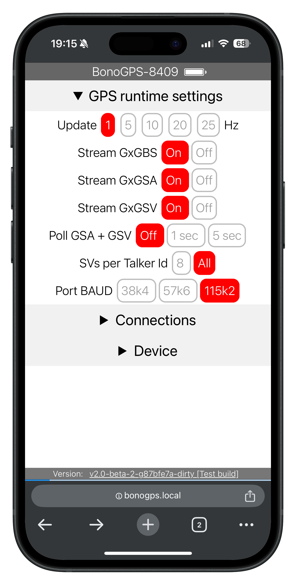
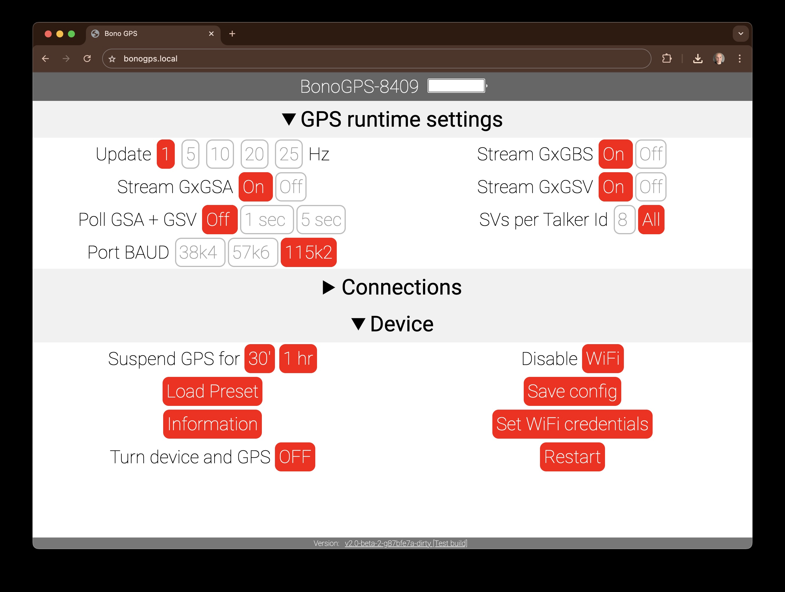

# What is BonoGPS?

- [For the track day enthusiast](#for-the-track-day-enthusiast)
- [For the SW Engineer / maker](#for-the-sw-engineer--maker)
- [HowTo](#howto)
  - [Daily Usage](#daily-usage)
    - [Save a configuration](#save-a-configuration)
  - [Connecting to an app](#connecting-to-an-app)
- [Hardware build instructions](#hardware-build-instructions)
  - [GPS Choice and setup preconfiguration](#gps-choice-and-setup-preconfiguration)
- [Software build instructions](#software-build-instructions)
- [Possible enhancements and ideas](#possible-enhancements-and-ideas)
- [Credits and tools](#credits-and-tools)

## For the track day enthusiast

The main goal of this device is to **make GPS data (speed, location) available to mobile apps that can record data, for example for track riding**. While there are many good (and not even too expensive) solutions out there, COVID-19 happened and this was a great way to spend some time building something myself.

Currently these apps are supported

1. [Harry's Lap Timer](https://www.gps-laptimer.de) >> details [here](software/connecting/harrylaptimer)
2. [TrackAddict](https://www.hptuners.com/product/trackaddict-app/) >> details [here](software/connecting/trackaddict)
3. [RaceChrono](https://racechrono.com/) >> details [here](software/connecting/racechrono)
4. [RaceTime](https://www.racetimeapp.com/en/) >> details [here](software/connecting/racetime)

If you are not into the *maker* thing or if you don't know anyone that might be, [invest 150$ and buy a XGPS160](https://gps.dualav.com/explore-by-product/xgps160) - it's effective and it works very well with a large number of supported platforms and apps.

## For the SW Engineer / maker

This repo contains software, list of hardware, and (simple) schematics  to build an ESP32 device to reads NMEA sentences from a GPS receiver compatible with u-blox M8 (for example  [BN880](https://www.amazon.com/Geekstory-Navigation-Raspberry-Aircraft-Controller/dp/B078Y6323W), [BN220](https://www.amazon.com/Navigation-Raspberry-Betaflight-Geekstory-Shipping/dp/B07PRDY6DS), or [DIYmall Micro GPS with NEO-M8N](https://www.amazon.com/DIYmall-NEO-M8N-Module-HMC5983-Antenna/dp/B012RNLG0K) ) and repeats them back to a logger device, either

1. a TCP/IP socket
2. a Bluetooth Low Energy (BLE) service
3. a BT Classic (BT-SPP) stream

The logger device is likely going to be one of the *Track Lap time apps* listed above running on your phone.

Examples of actual devices are in [hardware/assembled](hardware/assembled), at a cost of 25$ and 40$ (GPS receivers with active antennas are a little bit more expensive but worth it, and a larger battery helps as well)

A web configuration (extremely basic responsive HTML) panel allows changing configuration and select GPS parameters on the fly: access it via [http://bonogps.local](http://bonogps.local) (when in WiFi AP mode, this becomes [http://10.0.0.1](http://10.0.0.1) on Android without mDNS resolution).

The settings required by each app are available as presets that you can load for your device (iOS, Android). More information on what version, features, and connections of each app are in [software/connecting](software/connecting).

You can also interface your GPS to [uBlox u-center](https://www.u-blox.com/en/product/u-center) via TCP/IP, in this case be aware that the uart speed is fixed.

## HowTo

### Daily Usage

1. Turn on the ESP32 and wait a few minutes for the GPS to get a fix on position (on BN devices, the red led will blink every second)
2. Open your preferred mobile app and connect it to your BonoGPS-*ABCD* device (ABCD is a combination of 4 letters and numbers unique to your ESP32 device)
3. Enjoy your ride!

Most runtime configurations are managed via its web-based interface: you can use your phone or any device with a web browser which is able to connect to either the built-in Access Point the BonoGPS provides or (if you are home and on you have configured the WiFi Client credentials) [http://bonogps.local](http://bonogps.local)

The local built-in access point will be named BonoGPS-*ABCD* device (ABCD is a combination of 4 letters and numbers unique to your ESP32 device) and the password to it is in the source code (you can change it to your discretion - it's simply meant to avoid anyone connecting by mistake)

- **GPS runtime settings:** GPS messages, rate of updates, serial port speed
- **Connections:** List clients, enable BLE/BT-SPP connectivity, enable/disable the builtin TCP-IP messages repeater, switch between WiFi client to a well-known WiFi network or built-in Access Point
- **Device:** Put GPS in powersaving for some time, Disable WiFi, load preset configurations, save current configuration, collect information about current status of the device, save WiFi credentials for client mode restart the ESP32

The BOOT button (or another button of your choice) allows you to loop between WiFi modes on the fly:

- short press: toggle between WiFi Access Point (built in led, usually blue, slowly blinking 500 ms cycle [see it](hardware/esp32/wifi_ap.webm)) and no WiFi (built in led off)
- long press (at least 2 seconds): enable WiFi Client so that you can reach the unit from your preferred WiFi network (internal led/blue led light flashes rapidly 250 ms cycle [see it](hardware/esp32/wifi_client.webm))

#### Save a configuration

If you load a preset or if you change a runtime settings, you can preserve it across restart of the device.

Go to *Device > Save Config* and you'll find these options

For convenience, the WiFi status (Start its own AP, or connect to a local WiFi) can be excluded or saved separately.

### Connecting to an app

There are many mobile apps to log lap times, few accept custom devices, in particular on iOS. The ones below are tested.

|         | Harry Lap Timer    | TrackAddict | RaceChrono | Racetime |
| ------- | ------------------ | ----------- | ---------- | -------- |
| iOS     | **BLE**, TCP-IP    |             |            |
| Android | **BT-SPP**, TCP-IP | BT-SPP      | BT-SPP     | BT-SPP   |

See more info in each subfolder of **[connecting](software/connecting)**.

You can load a preset configuration from the configuration page selecting *Device > Load Preset* and then choosing your mobile phone device and app combination (when there are alternatives, the recommended option is in bold)

## Hardware build instructions

The minimum build is a ublox M8 series GPS receiver module connected to an ESP32:

- TX/RX from the GPS to a serial port (default in the code is UART2/Serial2) on ESP32. Remember: you need to connect RX on one device to TX on the other and viceversa
- the GPS power pins to ESP32: VCC to 3v3, GND to GND

BN220 comes with a 4 pin adapter cable for GND TX RX VCC, while BN880 includes 2 additionals pins for SDA and SCL of the IMU which are not used so you should leave them unconnected.

Schematics are relatively simple

- power the GPS module (3.3V on ESP32 to VCC on GPS receiver, GND on ESP32 to GND on GPS receiver)
- connect GPS RX to ESP32 UART2 TX and GPS TX to ESP32 UART2 RX (RX and TX are switched: GPS transmits, ESP32 receives)

Examples are in [hardware/assembled](hardware/assembled) including an example with more options using an ESP32 device type Lolin D32 Pro which has an internal battery charger [hardware/esp32/lolin_d32_pro.md](hardware/esp32/lolin_d32_pro.md)

### GPS Choice and setup preconfiguration

Thanks to needs of a very active drone community, there are a lot of inexpensive GPS receivers: some considerations on performance/accuracy/cost are reported [in the hardware/GPS folder](hardware/GPS).

What you need to configure is documented [in the hardware/GPS folder](hardware/GPS): this is **important**, the performances of your GPS won't be optimal until you do, or the whole setup will not work at all.

## Software build instructions

This code is developed specifically for ESP32, and tested with [PlatformIO](https://platformio.org/) (main development platform) and the [Arduino IDE (1.8.13)](https://www.arduino.cc/en/software). More information on what libraries are needed and software organization [in the software/building folder](software/building).

## Possible enhancements and ideas

See [issues with label enhancement](https://github.com/renatobo/bonogps/issues?q=is%3Aissue+is%3Aopen+label%3Aenhancement) on the github project

## Credits and tools

- Very valuable information from the mobile apps developers: [Harry's Lap Timer forum](http://forum.gps-laptimer.de/viewforum.php?f=2), [HP Tuner Track Adict forum](https://forum.hptuners.com/forumdisplay.php?74-TrackAddict), [RaceChrono forum](https://racechrono.com/forum/categories/diy-builds)
- Email conversations with Harald Schlangmann (Harry's Lap Timer) and Roberto Morini (Racetime) who I thank for the time and effort in developing and supporting their apps
- There are several other similar projects on github, a few from which I learned a lot: [RaceChronoDYI-TBeam](https://github.com/0x8008135/RaceChronoDYI-TBeam) [RaceChrono BLE DIY device (GPS and CAN-Bus)](https://github.com/aollin/racechrono-ble-diy-device) [DAWA](https://github.com/quichedood/DAWA-6.x)
- Screenshot framing by [Mockuphone](https://mockuphone.com/) and [Android developers marketing tools
](https://developer.android.com/distribute/marketing-tools/device-art-generator)
- [The GPS Dictionary](https://www.u-blox.com/sites/default/files/the_gps_dictionary.pdf)
