# Which GPS receiver?

This project requires a receiver compatible with ublox M8, for the following reasons

* it's widely available as it's used in avionics (drones) projects
* it's cost effective
* it allows 10Hz refresh rate
* it allows granular configuration of NMEA messages

#### Q: Can I use a cheaper Neo-6M module?

**A:** not really, as it gives a max of 5Hz frequency and its performance are far less than a Neo-8M module for a fraction more of the cost

#### Q: Can I use a newer Neo-9M module?
**A:** It could work, but this project is not tested for it yet.

#### Q: What modules are recommended?
**A:** Genuine ublox M8 are best, with an active antenna that is tuned for GPS+Glonass+Galileo. Too much to say about this subject.

#### Q: No data is made available to my apps, what's wrong?
**A:** First thing to check is: is the PORT RATE stored in your GPS (see below paragraph **UBX-CFG-PRT**) matching the one expected by the bonogps.cpp code in macro `GPS_STANDARD_BAUD_RATE` ? It should be 115200. Open an issue otherwise so that we can work out troubleshooting

#### Q: M8N, M8Q, M8U .. which one?
**A:** According to the [NEO-M8-FW3 datasheet](https://www.u-blox.com/sites/default/files/NEO-M8-FW3_DataSheet_%28UBX-15031086%29.pdf), you should avoid NEO-M8N as it's limited to 5 Hz for 2 or more concurrent constellations (e.g. GPS+<GLONASS/Galileo> or even all three). NEO-M8Q and NEO-M8M have 10Hz for multiple constellations, and 18Hz for a single one. Read up [here](https://discuss.ardupilot.org/t/gps-config-u-blox-m8n/46970/34) as well.

# GPS modules setup

_Note: these instructions are specific to a GPS module compatile with ublox 8 messages._

You can setup an out of the box M8 module restoring one of these saved configurations:

* passive antenna [BN220](gps-bn220-config.txt)
* active antenna [BN820](gps-bn880-config.txt)

The procedure is 

1. Connect the receiver to your PC (a FTDI USB to TTL module comes handy, the same one used to program arduino boards without USB ports, [example](https://www.amazon.com/s?k=ftdi+usb+to+serial&i=electronics&ref=nb_sb_noss_1) )
2. Open U-Center and connect to the serial device used at step 1
3. go to Tools -> GNSS Configuration
4. find one of the saved configuration files in this folder
5. Select "Store Configrations into BBR/Flash'
6. Click 'File > GNSS'

at this point the configuration is stored on your device in its flash memory. Please note some cheap GPS receiver modules do not have flash memory and they will not work for this project.

Save configuration is notably (as is - several sources say so and I find it as well) unreliable, so please run it more than a few times and check that settins have actually been saved across resets/power downs.

# Setup on your own, step by step 

## Settings that are required

After an established connection with your GPS, open 'View > Messages' or press F9

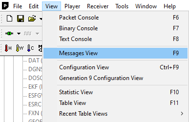

then go the UBX section

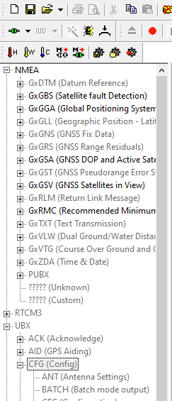

### UBX-CFG-GNSS

More satellites and constellations (GPS, Galileo, GLONASS) does not necessarily mean better results: hardware here limits performances, so you might have to compromise speed for amount of data.

There is plenty of information online on drone GPS solutions that explain the optimal update rate for each hardware (e.g. [ArduPilot](https://github.com/ArduPilot/ardupilot/issues/13053)).

Configurations tested, optimized for Americas:

* BN-880, BN220, NEO-M8Q, NEO-M8M and other devices capable of 10Hz with 2+ constellations: Enable GPS, SBAS, Galileo, Glonass

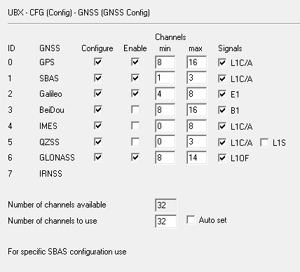

* NEO-M8N: GPS, SBAS (unless you are happy with 5Hz, then you can enable additional ones)

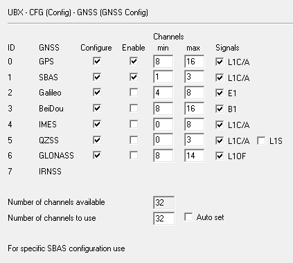


Common

* BeiDou has good coverage in APAC, so disabled for NAMER to use Galileo+Glonass
* IMES disabled as ineffective for this use
* QZSS disabled as it is specific for APAC


M8N (Enabled: GPS, SBAS)

```
B5 62 06 3E 3C 00 00 00 20 07 00 08 10 00 01
00 01 01 01 01 03 00 01 00 01 01 02 04 08 00
00 00 01 01 03 08 10 00 00 00 01 01 04 00 08
00 00 00 01 01 05 00 03 00 00 00 01 01 06 08
0E 00 00 00 01 01 2D 79
```

BN-880, BN-220, M8Q and other devices at 10Hz with multiple constellations (Enabled: GPS, SBAS, Galileo, GLONASS)

```
B5 62 06 3E 3C 00 00 20 20 07 00 08 10 00 01
00 01 01 01 01 03 00 01 00 01 01 02 04 08 00
01 00 01 01 03 08 10 00 00 00 01 01 04 00 08
00 00 00 01 03 05 00 03 00 00 00 01 05 06 08
0E 00 01 00 01 01
```

### UBX-CFG-MSG

* First disable all messages (click on the top level node NMEA, right click -> 'Disable child messages')

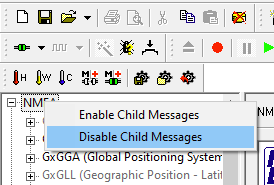

* Enable `GxGGA` and `GxRMC` messages

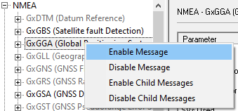

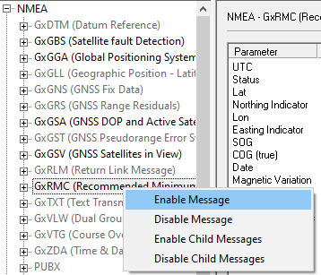

Disable all messages

```
B5 62 06 01 03 00 F0 0A 00 04 23
B5 62 06 01 03 00 F0 09 00 03 21
B5 62 06 01 03 00 F0 00 00 FA 0F
B5 62 06 01 03 00 F0 01 00 FB 11
B5 62 06 01 03 00 F0 0D 00 07 29
B5 62 06 01 03 00 F0 06 00 00 1B
B5 62 06 01 03 00 F0 02 00 FC 13
B5 62 06 01 03 00 F0 07 00 01 1D
B5 62 06 01 03 00 F0 03 00 FD 15
B5 62 06 01 03 00 F0 0F 00 09 2D
B5 62 06 01 03 00 F0 04 00 FE 17
B5 62 06 01 03 00 F0 05 00 FF 19
B5 62 06 01 03 00 F0 08 00 02 1F
B5 62 06 01 03 00 F1 00 00 FB 12
B5 62 06 01 03 00 F1 01 00 FC 14
B5 62 06 01 03 00 F1 03 00 FE 18
B5 62 06 01 03 00 F1 04 00 FF 1A
B5 62 06 01 03 00 F1 05 00 00 1C
B5 62 06 01 03 00 F1 06 00 01 1E
```

Enable `GGA`

```
B5 62 06 01 03 00 F0 00 01 FB 10
```
then enable `RMC`

```
B5 62 06 01 03 00 F0 04 01 FF 18
```

### UBX-CFG-NMEA

This is automatically set when changing the number of SV's, no need to set it

* NMEA messages: 4.10 format
* Max SVs `0 - Standard`
* Mode Flags: Consider Mode checked
* Numbering used for SVs not supported by NMEA: `1 - Extended (3 digit)`
* Main Talker ID `0 - System dependent`
* GSV Talker ID `0 - GNSS Specific`

If you are using BeiDou, there might be additional configuration required

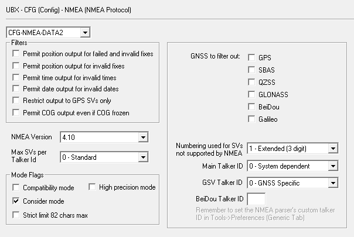

```
B5 62 06 17 14 00 00 41 00 02 00 00 00 00 01
00 00 01 00 00 00 00 00 00 00 00 76 63
```

### UBX-CFG-PRT

go to UBX > CFG > PRT (Port) node and for Target 1 set

* Protocol In: `0+1 UBX+MNEA`
* Protocol Out: `0+1 UBX+MNEA`
* Baudrate: `115200`
  
Version 1 required a predefine Baudrate, but it caused issues when a temporary value was changed, so from version 1.1 BonoGPS tries to automatically set the baud rate.

If you have long cables, you might want to test `56k`

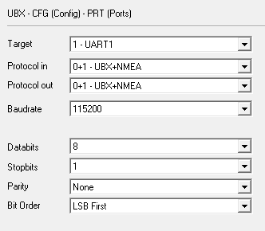

```
B5 62 06 00 14 00 01 00 00 00 D0 08 00 00 00
C2 01 00 03 00 03 00 00 00 00 00 BC 5E 
```

### UBX-CFG-NAV5

The default configuration of these GPS receiver is optimized for pedestrian or slowly moving vehicles. We can suggest parameters that are a better fit for a fast vehicle

* Dynamic model -> 4 Automotive

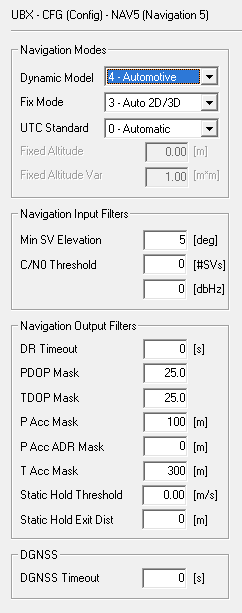


```
B5 62 06 24 24 00 FF FF 04 03 00 00 00 00 10
27 00 00 05 00 FA 00 FA 00 64 00 2C 01 00 00  
00 00 00 00 00 00 00 00 00 00 00 00 14 98
```

## Settings to optimize performances

### UBX-CFG-RATE

This is automatically set by the configuration portal, no need to set it. For 10Hz

* Time Source `0 - UTC Time` (not sure if `1 - GPS` is a better option)
* Measurement Period `100 ms`

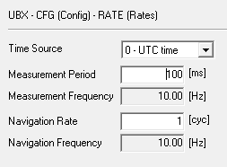

```
B5 62 06 08 06 00 64 00 01 00 00 00 79 10
```

On BN220 and other devices that can handle > 10 Hz, you can use 18Hz (not supported by the configuration portal right now)

```
B5 62 06 08 06 00 37 00 01 00 00 00 4C 02
```


### UBX-CFG-PMS

This sets optimal performances, sacrificing battery life

* Set `0 - Full Power`, and `Save Configuration`

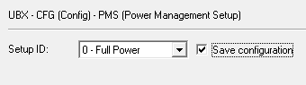

```
B5 62 06 86 08 00 00 00 00 00 00 00 00 00 94 5A
```

then

```
B5 62 06 09 0D 00 00 00 00 00 FF FF 00 00 00 00 
00 00 07 21 AF
```

### UBX-CFG-SBAS

* Enable SBAS
* Turn on Ranging, Correction Data
* If you are using GPS only, then you should enable Integrity information
* Number of search channels = 3 is configured in the CFG-GNSS panel
* Set SBAS specific to your region: use the PRN Codes WAAS for Americas, EGNOS for Europe. Auto-scan will identify them by itself at the cost of a longer startup time


#### Without Integrity, WAAS for Americas

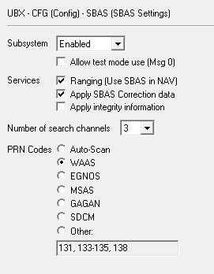


```
B5 62 06 16 08 00 01 03 03 00 00 E8 04 00 17 79
```

#### With Integrity, WAAS for Americas

```
B5 62 06 16 08 00 01 07 03 00 00 E8 04 00 1B 95
```


### UBX-CFG-NAVX5

* Message Version 2 (the default)
* AssistNow Autonomous `Use AssistNow Autonomous`

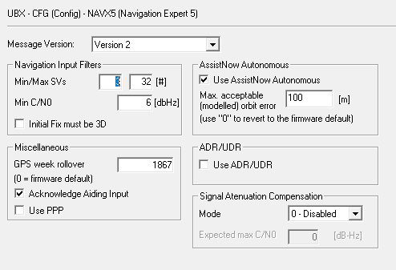

```
B5 62 06 23 28 00 02 00 4C 66 C0 00 00 00
00 00 03 20 06 00 00 00 00 01 4B 07 00 00
00 00 00 00 00 01 00 00 64 00 00 00 00 00
00 00 00 00 A6 82
```

### UBX-CFG-ITFM

* Enable jamming and interference

#### With Active Antenna (BN-880)

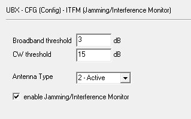

```
B5 62 06 39 08 00 F3 AC 62 AD 1E 63 00 00 76 A5
```

#### With Passive Antenna (BN-220)

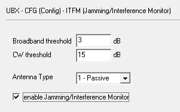

```
B5 62 06 39 08 00 F3 AC 62 AD 1E 53 00 00 66 75
```

### Messages that do not required changes

* CFG-ANT
* CFG-DAT
* CFG-INF
* CFG-ODO
* CFG-PM2 *-> use UBX-CFG-PMS instead*
* CFG-RXM *-> use UBX-CFG-PMS instead*
* CFG-TP5
* CFG-USB
* CFG-LOGFILTER

### Save Configuration

* Open menu "Receiver > Action > Save config"

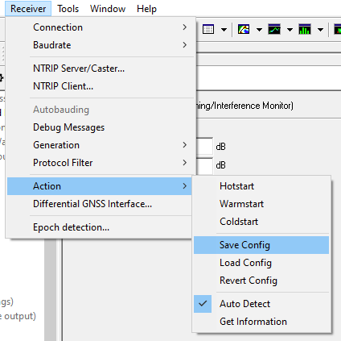

or issue

```
B5 62 06 09 0D 00 00 00 00 00 FF FF 00 00 00 00 00 00 17 31 BF
```

# References

* [ublox M8 Receiver description](https://www.u-blox.com/sites/default/files/products/documents/u-blox8-M8_ReceiverDescrProtSpec_%28UBX-13003221%29.pdf)
* [Assist Now](https://portal.u-blox.com/s/question/0D52p00008eSdzE/how-to-enable-and-flash-assistnow-autonomous-on-zoem8b)
* [SBAS](https://github.com/cleanflight/cleanflight/blob/master/docs/Gps.md)
* [Enable Galileo](https://github.com/iNavFlight/inav/wiki/Ublox-3.01-firmware-and-Galileo)
* [UBX Tool](https://gpsd.io/ubxtool-examples.html)
* Setting PORT, Frequency and save settings from [freematics](https://freematics.com/forum/viewtopic.php?t=1759)
* [https://learn.sparkfun.com/tutorials/getting-started-with-u-center-for-u-blox/all](https://learn.sparkfun.com/tutorials/getting-started-with-u-center-for-u-blox/all)