# Which GPS receiver?

- [Which GPS receiver?](#which-gps-receiver)
  - [FAQ](#faq)
    - [Q: Can I use a cheaper Neo-6M module?](#q-can-i-use-a-cheaper-neo-6m-module)
    - [Q: Can I use a newer Neo-9M module?](#q-can-i-use-a-newer-neo-9m-module)
    - [Q: What modules are recommended?](#q-what-modules-are-recommended)
    - [Q: No data is made available to my apps, what's wrong?](#q-no-data-is-made-available-to-my-apps-whats-wrong)
    - [Q: M8N, M8Q, M8U .. which one?](#q-m8n-m8q-m8u--which-one)
  - [Comparison of performance vs precision](#comparison-of-performance-vs-precision)
    - [3 hours of measurements side by side](#3-hours-of-measurements-side-by-side)
  - [GPS modules setup via presaved configuration](#gps-modules-setup-via-presaved-configuration)
  - [Setup on your own, step by step](#setup-on-your-own-step-by-step)
    - [Settings that are required](#settings-that-are-required)
      - [UBX-CFG-GNSS](#ubx-cfg-gnss)
        - [GPS, SBAS, Galileo, GLONASS](#gps-sbas-galileo-glonass)
        - [GPS, SBAS](#gps-sbas)
      - [UBX-CFG-MSG](#ubx-cfg-msg)
      - [UBX-CFG-NMEA](#ubx-cfg-nmea)
      - [UBX-CFG-PRT](#ubx-cfg-prt)
      - [UBX-CFG-NAV5](#ubx-cfg-nav5)
    - [Settings to optimize performances](#settings-to-optimize-performances)
      - [UBX-CFG-RATE](#ubx-cfg-rate)
      - [UBX-CFG-PMS](#ubx-cfg-pms)
      - [UBX-CFG-SBAS](#ubx-cfg-sbas)
        - [Without Integrity, WAAS for Americas](#without-integrity-waas-for-americas)
        - [With Integrity, WAAS for Americas](#with-integrity-waas-for-americas)
      - [UBX-CFG-NAVX5](#ubx-cfg-navx5)
      - [UBX-CFG-ITFM](#ubx-cfg-itfm)
        - [With Active Antenna (e.g. BN-880)](#with-active-antenna-eg-bn-880)
        - [With Passive Antenna (e.g. BN-220)](#with-passive-antenna-eg-bn-220)
    - [Messages that do not required changes](#messages-that-do-not-required-changes)
    - [Save Configuration](#save-configuration)
  - [References](#references)

This project requires a receiver compatible with inexpensive Beitian M8 (classic) or M9 series (performance)

- they are widely available: used in avionics (drones) projects
- cost-effective
- allow 10Hz (M8 Classic) to 25Hz (M10 Performance series) refresh rate
- granular configuration of NMEA messages

## FAQ

### Q: Can I use a cheaper Neo-6M module or Beitian M10 BE-XXX series?

**A:** Neo-6M not really, as it gives a max of 5Hz frequency and its performance are far less than a Neo-8M module for a fraction more of the cost. Beitian BE-XXX series is limited to 4 Hz, so that's also a no.

### Q: Can I use a newer M9 module?

**A:** Yes - testing performed on some M9 Beitian devices like BK880 and BK280 confirm them as good choices if you are looking at 25 Hz refresh

### Q: What modules are recommended?

**A:** Genuine ublox are best, with an active antenna that is tuned for GPS+Glonass+Galileo. Too much to say about this subject, see the discussion forum.

### Q: No data is made available to my apps, what's wrong?

**A:** First thing to check is: is the PORT RATE stored in your GPS (see below paragraph **UBX-CFG-PRT**) matching the one expected by the bonogps.cpp code in macro `GPS_STANDARD_BAUD_RATE` ? It should be 115200. Open an issue otherwise so that we can work out troubleshooting

### Q: M8N, M8Q, M8U .. which one?

**A:** According to the [NEO-M8-FW3 datasheet](https://www.u-blox.com/sites/default/files/NEO-M8-FW3_DataSheet_%28UBX-15031086%29.pdf), you should avoid NEO-M8N as it's limited to 5 Hz for 2 or more concurrent constellations (e.g. GPS+<GLONASS/Galileo> or even all three). NEO-M8Q and NEO-M8M have 10Hz for multiple constellations, and 18Hz for a single one. Read up [here](https://discuss.ardupilot.org/t/gps-config-u-blox-m8n/46970/34) as well. Beitian uses a different naming convention and it can be confusing: check specs for (a) refresh rate (b) type of antenna

## Comparison of performance vs precision

A comparison in a static location with clear sky among performance (speed = navigation rate, intensity = SV CN0) and precision (HDOP):

| Module | Chipset | Antenna | Multi-Constellation Rate | GPS Only Rate | Signal Quality (C/N0) | Precision | Notes |
| ------ | ------- | ------- | ------------------------ | ------------- | --------------------- | --------- | ----- |
| BK880 | M10 | Active | 25 Hz | 25 Hz | 35-40 dBHz | Excellent | Best choice for track use |
| BK280 | M10 | Passive | 25 Hz | 25 Hz | 30-35 dBHz | Excellent | Best budget option |
| NEO-M8N | M8N | Active | 5 Hz | 10 Hz | 35-40 dBHz | Very Good | Genuine u-blox, slow refresh |
| BN880 | M8 | Active | 10 Hz | 18 Hz | 30-35 dBHz | Good | Good balance |
| BN220 | M8 | Passive | 10 Hz | 18 Hz | ~30 dBHz | Good | Budget, may struggle in poor visibility |

**Key Findings:**
- **M10 modules (BK series)** offer the best overall performance with 25Hz support
- **Active antennas** significantly improve signal quality (5-10 dBHz better)
- **Signal quality (C/N0):** Higher is better; 35+ dBHz is excellent
- **Galileo** provides better precision than GLONASS in current testing

### 3 hours of measurements side by side

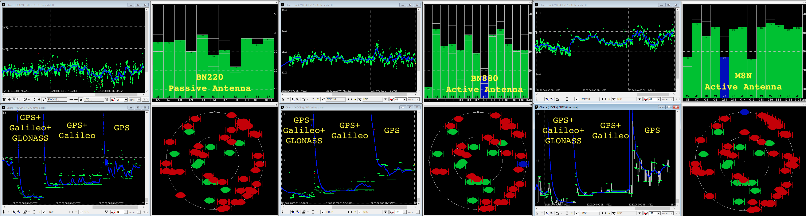

## GPS modules setup via presaved configuration

To reduce complexity of this software, you need to save a baseline configuration of your GPS module. Parameters include

- default port speed (it should match GPS_STANDARD_BAUD_RATE, starting from v1.1 there is a basic auto baud rate detection)
- what satellite systems to use (GPS, Glonass, Galileo, BeiDou)
- what Wide Area Augmentation System to be used
- disable all unnecessary NMEA messages
- set motion defaults

... etc.

_Note: these instructions are specific to a GPS module compatile with ublox 8 messages._

You can setup an out of the box M8 module restoring one of these saved configurations:

- passive antenna [BN220](gps-bn220-config.txt)
- active antenna [BN820](gps-bn880-config.txt)

The procedure is

1. Connect the receiver to your PC (a FTDI USB to TTL module comes handy, the same one used to program Arduino boards without USB ports, [example](https://www.amazon.com/s?k=ftdi+usb+to+serial&i=electronics&ref=nb_sb_noss_1));
2. Open U-Center and connect to the serial device used at step 1 (you can configure correct COM port and Baudrate under Receiver tab);
3. Go to Tools -> GNSS Configuration or Tools -> Receiver Configuration, depending on your U-Center version;
4. Find one of the saved configuration files in this folder;
5. Select your GPS module series (BN220 and BN820 is M8);
6. Select "Store Configurations into BBR/Flash";
7. Click 'File > GNSS'.

At this point the configuration is stored on your device in its flash memory. Please note that some cheap GPS receiver modules do not have flash memory and they will not work for this project.

The example configuration offered in this repo configures the default baudrate of the GPS receiver at 115200 (which is the expected baudrate by bonogps software), but sometimes the GPS receiver has a factory default of 9600 baudrate. This will lead to connection errors as soon as U-Center applies the baudrate setting. So, once you start receiving connection errors, configure the baudrate to 115200 via (Receiver -> Baudrate). After that, the flashing should continue normally.

Save configuration is notably (as is - several sources say so and I find it as well) unreliable, so please run it more than a few times and check that settings have actually been saved across resets/power downs.

## Setup on your own, step by step

### Settings that are required

After an established connection with your GPS, open 'View > Messages' or press F9

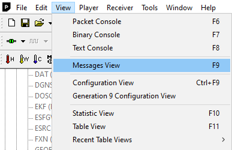

then go the UBX section

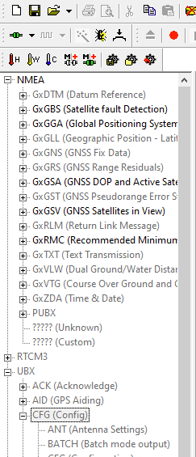

#### UBX-CFG-GNSS

More satellites and constellations (GPS, Galileo, GLONASS) does not necessarily mean better results: hardware here limits performances, so you might have to compromise speed for amount of data.

There is plenty of information online on drone GPS solutions that explain the optimal update rate for each hardware (e.g. [ArduPilot](https://github.com/ArduPilot/ardupilot/issues/13053)).

Configurations tested, optimized for NAMER:

- BK280, BK880 or other 10 series capable of 20Hz or 25Hz with 2+ constellations and tracking 42 channels: Enable GPS, SBAS, Galileo, Glonass
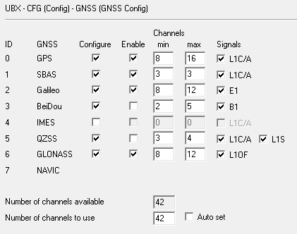


- BN-880, BN220, NEO-M8Q, NEO-M8M and other devices capable of 10Hz with 2+ constellations: Enable GPS, SBAS, Galileo, Glonass
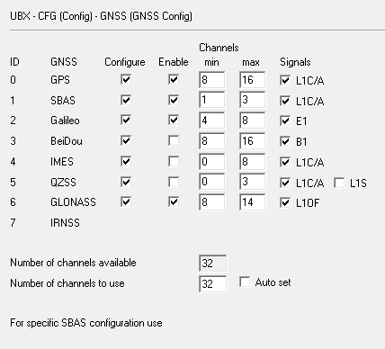

- NEO-M8N: GPS, SBAS (unless you are happy with 5Hz, then you can enable additional ones)
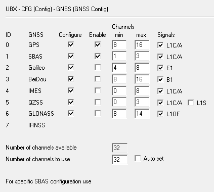

Common for NAMER users

- GPS, Galileo, Glonass: enabled
- SBAS: enabled
- BeiDou has good coverage in APAC => disabled 
- IMES disabled as ineffective for this use
- QZSS is used to improve coverage in East Asia and Oceania => disabled

##### GPS, SBAS, Galileo, GLONASS

BK-880, BK-280, M10 and other devices at 25Hz with multiple constellations up to 42 satellites

```text
B5 62 06 3E 34 00 00 00 2A 06 00 08 10 00 01
00 01 01 01 03 03 00 01 00 01 01 02 08 0C 00
01 00 01 01 03 02 05 00 00 00 01 01 05 03 04
00 00 00 05 01 06 08 0C 00 01 00 01 01 21 DE
```

BN-880, BN-220, M8Q and other devices at 10Hz with multiple constellations

```text
B5 62 06 3E 3C 00 00 20 20 07 00 08 10 00 01
00 01 01 01 01 03 00 01 00 01 01 02 04 08 00
01 00 01 01 03 08 10 00 00 00 01 01 04 00 08
00 00 00 01 03 05 00 03 00 00 00 01 05 06 08
0E 00 01 00 01 01
```

##### GPS, SBAS

E.g. to use 10Hz on M8N

```text
B5 62 06 3E 3C 00 00 00 20 07 00 08 10 00 01
00 01 01 01 01 03 00 01 00 01 01 02 04 08 00
00 00 01 01 03 08 10 00 00 00 01 01 04 00 08
00 00 00 01 01 05 00 03 00 00 00 01 01 06 08
0E 00 00 00 01 01 2D 79
```

#### UBX-CFG-MSG

- First disable all messages (click on the top level node NMEA, right click -> 'Disable child messages')

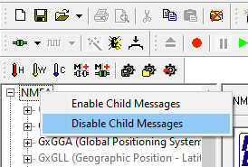

- Enable `GxGGA` and `GxRMC` messages

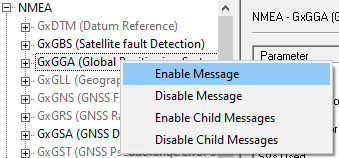

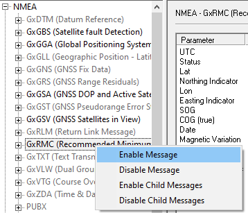

Disable all messages

```text
B5 62 06 01 03 00 F0 0A 00 04 23
B5 62 06 01 03 00 F0 09 00 03 21
B5 62 06 01 03 00 F0 00 00 FA 0F
B5 62 06 01 03 00 F0 01 00 FB 11
B5 62 06 01 03 00 F0 0D 00 07 29
B5 62 06 01 03 00 F0 06 00 00 1B
B5 62 06 01 03 00 F0 02 00 FC 13
B5 62 06 01 03 00 F0 07 00 01 1D
B5 62 06 01 03 00 F0 03 00 FD 15
B5 62 06 01 03 00 F0 0F 00 09 2D
B5 62 06 01 03 00 F0 04 00 FE 17
B5 62 06 01 03 00 F0 05 00 FF 19
B5 62 06 01 03 00 F0 08 00 02 1F
B5 62 06 01 03 00 F1 00 00 FB 12
B5 62 06 01 03 00 F1 01 00 FC 14
B5 62 06 01 03 00 F1 03 00 FE 18
B5 62 06 01 03 00 F1 04 00 FF 1A
B5 62 06 01 03 00 F1 05 00 00 1C
B5 62 06 01 03 00 F1 06 00 01 1E
```

Enable `GGA`

```text
B5 62 06 01 03 00 F0 00 01 FB 10
```

then enable `RMC`

```text
B5 62 06 01 03 00 F0 04 01 FF 18
```

#### UBX-CFG-NMEA

This is automatically set when changing the number of SV's, no need to set it

- NMEA messages: 4.10 format
- Max SVs `0 - Standard`
- Mode Flags: Consider Mode checked
- Numbering used for SVs not supported by NMEA: `1 - Extended (3 digit)`
- Main Talker ID `0 - System dependent`
- GSV Talker ID `0 - GNSS Specific`

If you are using BeiDou, there might be additional configuration required

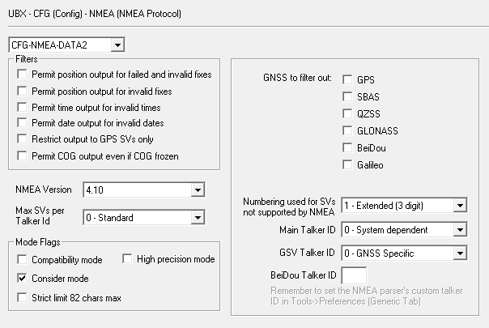

```text
B5 62 06 17 14 00 00 41 00 02 00 00 00 00 01
00 00 01 00 00 00 00 00 00 00 00 76 63
```

#### UBX-CFG-PRT

go to UBX > CFG > PRT (Port) node and for Target 1 set

- Protocol In: `0+1 UBX+MNEA`
- Protocol Out: `0+1 UBX+MNEA`
- Baudrate: `115200`
  
Version 1 required a predefine Baudrate, but it caused issues when a temporary value was changed, so from version 1.1 BonoGPS tries to automatically set the baud rate.

If you have long cables, you might want to test `56k`

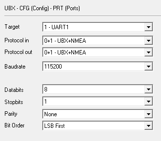

```text
B5 62 06 00 14 00 01 00 00 00 D0 08 00 00 00
C2 01 00 03 00 03 00 00 00 00 00 BC 5E 
```

#### UBX-CFG-NAV5

The default configuration of these GPS receiver is optimized for pedestrian or slowly moving vehicles. We can suggest parameters that are a better fit for a fast vehicle

- Dynamic model -> 4 Automotive

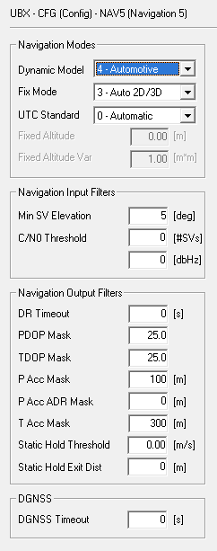

```text
B5 62 06 24 24 00 FF FF 04 03 00 00 00 00 10
27 00 00 05 00 FA 00 FA 00 64 00 2C 01 00 00  
00 00 00 00 00 00 00 00 00 00 00 00 14 98
```

### Settings to optimize performances

#### UBX-CFG-RATE

This is automatically set by the configuration portal, no need to set it. For 10Hz

- Time Source `0 - UTC Time` (not sure if `1 - GPS` is a better option)
- Measurement Period `100 ms`

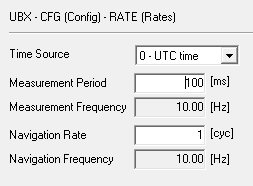

```text
B5 62 06 08 06 00 64 00 01 00 00 00 79 10
```

On BN220 and other devices that can handle > 10 Hz, you can use 18Hz (not supported by the configuration portal right now)

```text
B5 62 06 08 06 00 37 00 01 00 00 00 4C 02
```

#### UBX-CFG-PMS

This sets optimal performances, sacrificing battery life

- Set `0 - Full Power`, and `Save Configuration`

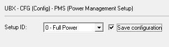

```text
B5 62 06 86 08 00 00 00 00 00 00 00 00 00 94 5A
```

then

```text
B5 62 06 09 0D 00 00 00 00 00 FF FF 00 00 00 00 
00 00 07 21 AF
```

#### UBX-CFG-SBAS

- Enable SBAS
- Turn on Ranging, Correction Data
- If you are using GPS only, then you should enable Integrity information
- Number of search channels = 3 is configured in the CFG-GNSS panel
- Set SBAS specific to your region: use the PRN Codes WAAS for Americas, EGNOS for Europe. Auto-scan will identify them by itself at the cost of a longer startup time

##### Without Integrity, WAAS for Americas

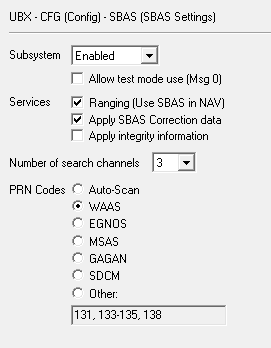

```text
B5 62 06 16 08 00 01 03 03 00 00 E8 04 00 17 79
```

##### With Integrity, WAAS for Americas

```text
B5 62 06 16 08 00 01 07 03 00 00 E8 04 00 1B 95
```

#### UBX-CFG-NAVX5

- Message Version 2 (the default)
- AssistNow Autonomous `Use AssistNow Autonomous`

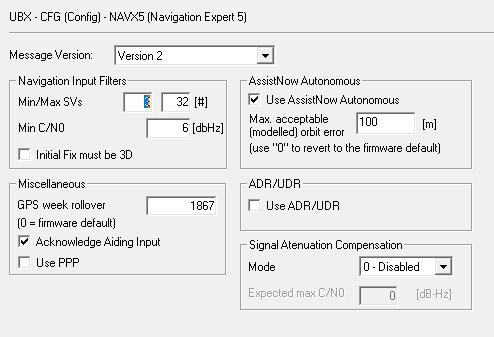

```text
B5 62 06 23 28 00 02 00 4C 66 C0 00 00 00
00 00 03 20 06 00 00 00 00 01 4B 07 00 00
00 00 00 00 00 01 00 00 64 00 00 00 00 00
00 00 00 00 A6 82
```

#### UBX-CFG-ITFM

- Enable jamming and interference

##### With Active Antenna (e.g. BN-880)

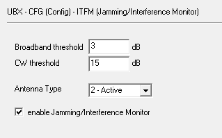

```text
B5 62 06 39 08 00 F3 AC 62 AD 1E 63 00 00 76 A5
```

##### With Passive Antenna (e.g. BN-220)

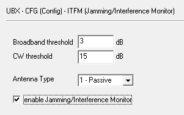

```text
B5 62 06 39 08 00 F3 AC 62 AD 1E 53 00 00 66 75
```

### Messages that do not required changes

- CFG-ANT
- CFG-DAT
- CFG-INF
- CFG-ODO
- CFG-PM2 *-> use UBX-CFG-PMS instead*
- CFG-RXM *-> use UBX-CFG-PMS instead*
- CFG-TP5
- CFG-USB
- CFG-LOGFILTER

### Save Configuration

- Open menu "Receiver > Action > Save config"

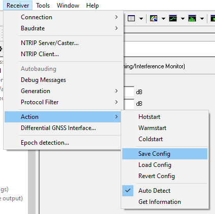

or issue

```text
B5 62 06 09 0D 00 00 00 00 00 FF FF 00 00 00 00 00 00 17 31 BF
```

## GPS Hardware Troubleshooting

### Module-Specific Issues

#### BN220 / BN880 Series (M8 Chipset)

**Problem:** GPS not responding / No communication with ESP32

**Solution:**
- Verify power connections: VCC to 3.3V (NOT 5V), GND to GND
- Check TX/RX are crossed: GPS TX → ESP32 RX, GPS RX → ESP32 TX
- Confirm baudrate is 115200 after configuration (factory default may be 9600)
- Try swapping TX/RX if no communication after verifying baudrate
- Measure voltage at GPS VCC pin - should be 3.0-3.6V

**Problem:** GPS has fix (LED blinking) but no data in app

**Solution:**
- Verify NMEA messages are enabled (not just UBX binary)
- Check Main Talker ID matches app requirements (GP for most apps, GN for Harry's Lap Timer)
- Load the correct preset for your app from web interface
- Verify baudrate is 115200 in both GPS config and ESP32 code

**Problem:** BN220 poor signal quality / slow to acquire

**Solution:**
- BN220 has passive antenna - signal quality will be lower than BN880
- Ensure clear sky view - even thin materials can significantly degrade signal
- Consider upgrading to BN880 (active antenna) or BK280/BK880 (M10 chipset)
- Passive antennas struggle in marginal conditions (urban canyons, heavy cloud cover)
- Expected C/N0: ~30 dBHz (compared to 30-35 dBHz for BN880)

**Problem:** Configuration not persisting after power cycle

**Solution:**
- Some cheap GPS modules lack flash memory - configuration is lost on power down
- Save configuration multiple times in U-Center (known to be unreliable)
- Verify "Store Configurations into BBR/Flash" is selected
- After saving, power cycle and verify settings persist
- If settings don't persist, module may not have flash - consider replacement

#### BK280 / BK880 Series (M10 Chipset)

**Problem:** Can't configure to 25Hz refresh rate

**Solution:**
- Verify your module is genuine M10 chipset (check label)
- M10 supports 25Hz with multiple constellations enabled
- In U-Center: View > Messages View > UBX > CFG > RATE
- Set Measurement Period to 40ms (25Hz = 1000ms/25)
- Ensure Time Source is set to UTC or GPS Time
- Save configuration to flash

**Problem:** Module not recognized in U-Center

**Solution:**
- Try multiple baudrates: 9600, 38400, 115200
- M10 modules may ship with different default baudrates
- Use "Auto Bauding" feature in U-Center
- Check physical connections to FTDI adapter
- Try different USB ports / cables

**Problem:** Performance worse than expected with 25Hz

**Solution:**
- Verify constellation configuration: GPS + Galileo + GLONASS + SBAS recommended
- Check that GSA/GSV messages are polled (not streaming) at low frequency (every 5 seconds)
- Streaming all messages at 25Hz can saturate UART - use selective message configuration
- Monitor ESP32 serial buffer overflow in logs

#### NEO-M8N (Genuine u-blox)

**Problem:** Limited to 5Hz with multiple constellations

**Solution:**
- This is normal behavior for M8N variant - hardware limitation
- M8N: 5Hz max with 2+ constellations, 10Hz with GPS only
- For higher rates with multiple constellations, use M8Q/M8M or M10 series
- Consider if accuracy improvement from multiple constellations worth lower refresh rate for your use case

**Problem:** Module more expensive but seems identical to BN880

**Solution:**
- Genuine u-blox modules have better signal quality (35-40 dBHz vs 30-35 dBHz)
- Better accuracy and consistency in challenging conditions
- Higher manufacturing quality and reliability
- Better support and documentation from u-blox
- Worth the premium for professional/critical applications

### Antenna Issues

**Problem:** Intermittent GPS fix / Signal drops

**Solution:**
- Check antenna cable connections (especially BN880 with separate antenna)
- Ensure antenna has clear sky view - 45° cone from vertical is minimum
- Verify antenna is mounted horizontally (patch antennas must face sky)
- Check for interference sources: phone chargers, LED lights, other RF devices
- Metal surfaces can improve ground plane but can also shield if antenna is too close

**Problem:** Active antenna not working (BN880, BK880)

**Solution:**
- Verify GPS module is providing power to antenna (3.3V on antenna connection)
- Check antenna cable for damage (especially at connectors)
- Active antennas have internal LNA - requires clean power supply
- Measure current draw: active antenna should draw 10-30mA additional
- Try passive antenna temporarily to isolate issue (antenna vs module)

**Problem:** GPS works on bench but not when installed in vehicle/bike

**Solution:**
- Metal fairing/tank can shield GPS signal
- Carbon fiber blocks GPS signals effectively - avoid mounting under CF
- Find location with least obstruction: top of seat cowl, under transparent plastics
- Test signal quality at installation location before finalizing mounting
- May need external antenna with longer cable to reach better location

### Configuration and Communication Issues

**Problem:** U-Center shows communication errors

**Solution:**
- Verify correct COM port selected
- Check FTDI adapter drivers installed (CH340, CP2102, FT232)
- Try lower baudrate (9600) if connection fails at 115200
- Ensure no other software accessing serial port simultaneously
- Windows: Check Device Manager for COM port conflicts
- Linux: Add user to dialout group: `sudo usermod -a -G dialout $USER`

**Problem:** Configuration changes not taking effect

**Solution:**
- After changing any UBX-CFG setting, click "Send" button in U-Center
- Watch for ACK/NAK response in message view
- NAK indicates parameter rejected - check valid ranges in u-blox documentation
- Changes are temporary until saved to flash with UBX-CFG-CFG
- Power cycle module after saving to verify persistence

**Problem:** NMEA messages contain wrong Talker ID

**Solution:**
- Configure UBX-CFG-NMEA Main Talker ID
- Options: 0=System dependent (usually GN), 1=GP, 2=GL, 3=GA, 4=GB
- Most apps require GP (GPS only talker)
- Harry's Lap Timer accepts GN (GNSS multi-constellation)
- Wrong Talker ID is #1 reason apps don't recognize GPS data

### Performance and Accuracy Issues

**Problem:** HDOP values too high / Poor accuracy

**Solution:**
- Ensure multiple constellations enabled (GPS + Galileo + GLONASS)
- Verify clear sky view - buildings/trees cause multipath errors
- Allow 5-15 minutes for almanac download on first fix
- Check number of satellites in use (need 6+ for good accuracy)
- Urban canyon effects can't be eliminated - need clear horizon
- Good HDOP: < 2.0, Acceptable: 2.0-5.0, Poor: > 5.0

**Problem:** Position jumps or drifts when stationary

**Solution:**
- Normal with consumer GPS - typical accuracy 2-3 meters
- Can be improved with SBAS (WAAS/EGNOS) enabled
- Static position will wander within accuracy circle
- Use dynamic model "Automotive" not "Stationary" for vehicle use
- Consider post-processing with RTKLIB if accuracy critical (not real-time)

**Problem:** Altitude readings inaccurate

**Solution:**
- GPS altitude is MSL (Mean Sea Level), not AGL (Above Ground Level)
- Vertical accuracy 1.5x worse than horizontal (typical: 3-5 meters vs 2-3 meters)
- Barometric altitude sensor needed for precise altitude
- Many track apps correct altitude using track database

### Testing and Validation

**Problem:** How to verify GPS is working correctly?

**Solution:**
1. **Check LED indicators** (BN modules):
   - Red LED blinking every second = GPS has fix
   - Red LED solid or irregular = No fix

2. **Use U-Center via TCP/IP**:
   - Connect BonoGPS via WiFi
   - U-Center: Receiver > Connection > Network > TCP
   - IP: 10.0.0.1 (AP mode) or bonogps.local (Client mode)
   - Port: 1818
   - View satellite constellation and signal strength

3. **Check web interface**:
   - Navigate to Device > Info
   - Should show GPS status, number of satellites, fix type

4. **Monitor serial output**:
   - Enable debug logging (`Core Debug Level > Debug`)
   - Check for NMEA sentences in serial monitor
   - Verify message format matches app requirements

**Problem:** How to compare GPS module performance?

**Solution:**
- Place modules side-by-side with clear sky view
- Record C/N0 (carrier-to-noise) values - higher is better
- Compare time to first fix (TTFF) - should be < 30 seconds (hot start)
- Check number of satellites tracked simultaneously
- Monitor HDOP values - lower is better
- Static test: measure position scatter over 10+ minutes
- Dynamic test: Record same track with different modules and compare

### Common Configuration Mistakes

**Problem:** Checklist of common configuration errors

**Common Mistakes:**
1. ❌ Wrong baudrate (ESP32 expects 115200, GPS still at 9600)
2. ❌ NMEA messages disabled (only UBX binary enabled)
3. ❌ Wrong Main Talker ID (app expects GP, GPS sending GN)
4. ❌ Configuration not saved to flash (lost on power cycle)
5. ❌ Too many messages streaming at high rate (UART overflow)
6. ❌ GSA/GSV streaming instead of polling (bandwidth waste)
7. ❌ Navigation mode set to "Stationary" instead of "Automotive"
8. ❌ TX/RX not crossed (GPS TX must go to ESP32 RX)
9. ❌ SBAS disabled (loses accuracy improvement)
10. ❌ Update rate too high for chipset (M8N can't do 10Hz with multi-GNSS)

### Getting Help with GPS Issues

If problems persist:
1. Test GPS with U-Center directly (bypass ESP32) to isolate hardware vs software issues
2. Check [u-blox support portal](https://portal.u-blox.com) for module-specific documentation
3. Review [GitHub Discussions - GPS topics](https://github.com/renatobo/bonogps/discussions/categories/q-a)
4. Post issue with:
   - GPS module model and chipset (M8/M9/M10)
   - Configuration used (attach U-Center config if possible)
   - U-Center screenshots showing satellite view and message traffic
   - Description of environment (indoor/outdoor, vehicle type, mounting location)

## References

- [ublox M8 Receiver description](https://www.u-blox.com/sites/default/files/products/documents/u-blox8-M8_ReceiverDescrProtSpec_%28UBX-13003221%29.pdf)
- [Assist Now](https://portal.u-blox.com/s/question/0D52p00008eSdzE/how-to-enable-and-flash-assistnow-autonomous-on-zoem8b)
- [SBAS](https://github.com/cleanflight/cleanflight/blob/master/docs/Gps.md)
- [Enable Galileo](https://github.com/iNavFlight/inav/wiki/Ublox-3.01-firmware-and-Galileo)
- [UBX Tool](https://gpsd.io/ubxtool-examples.html)
- Setting PORT, Frequency and save settings from [freematics](https://freematics.com/forum/viewtopic.php?t=1759)
- [https://learn.sparkfun.com/tutorials/getting-started-with-u-center-for-u-blox/all](https://learn.sparkfun.com/tutorials/getting-started-with-u-center-for-u-blox/all)
