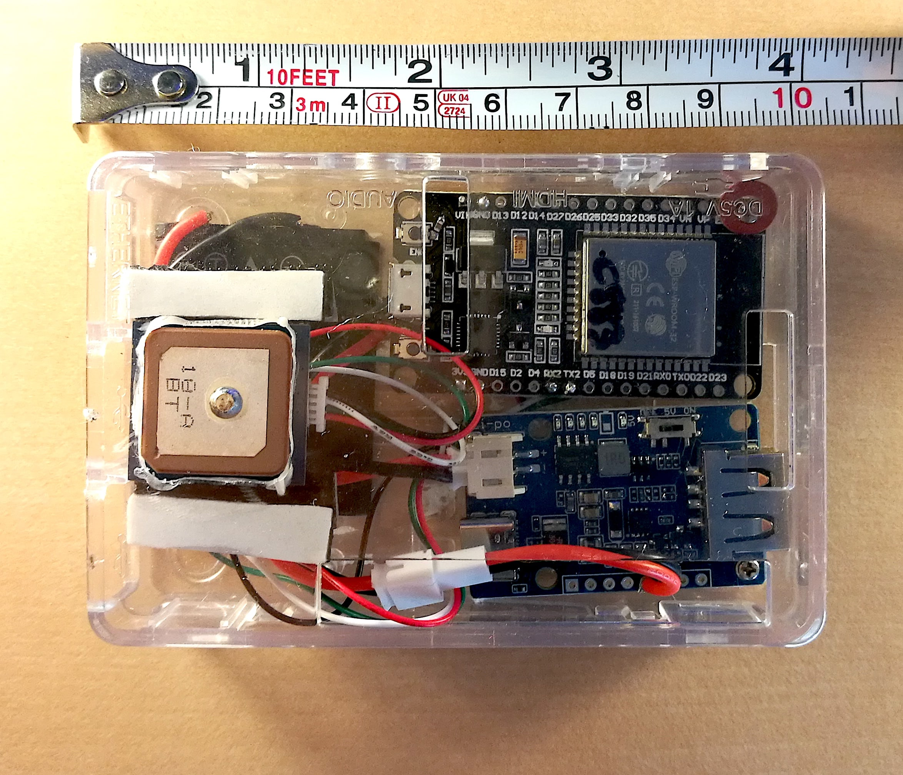
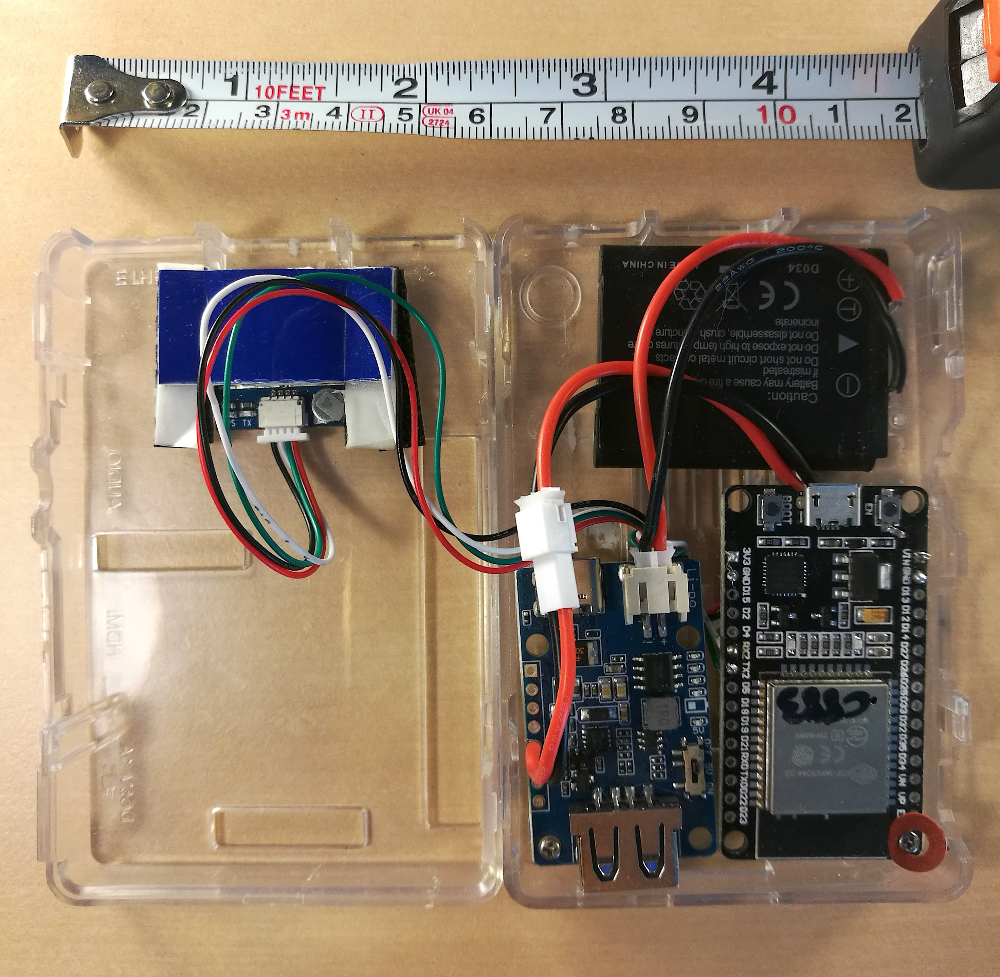
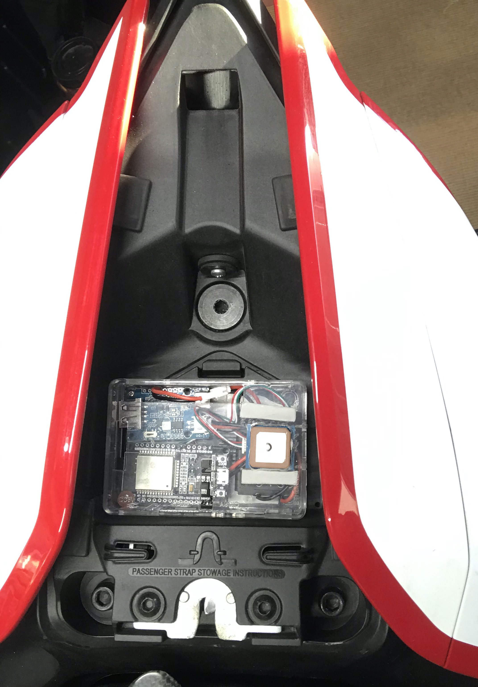
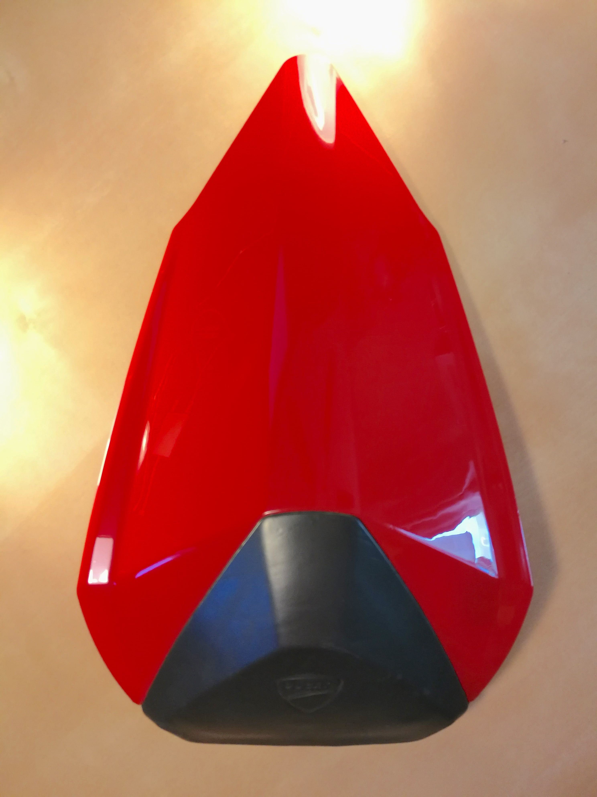
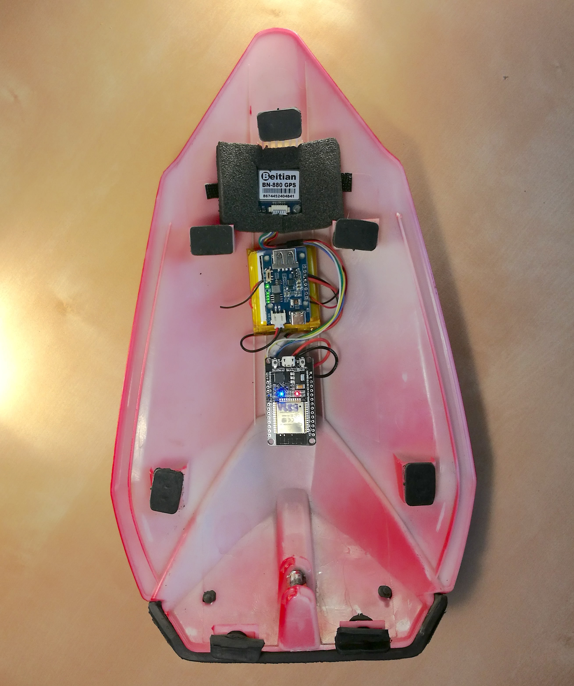

# A couple of working prototypes that don't look fancy but get the job done.

Hardware is similar for both and it's mostly based on things I could easily find:

* basic [ESP32 DEVKIT](https://www.amazon.com/D-FLIFE-Development-Dual-Mode-Microcontroller-Integrated/dp/B08DR31G4G) board
* seedstudio [LiPo Rider Plus](https://wiki.seeedstudio.com/Lipo-Rider-Plus/) charger (Why? The first LiPo charger I bumped into at MicroCenter while shopping with a couple of nice features such as fuel gauge)
* [BN220](https://www.amazon.com/Beitian-Navigation-Raspberry-Betaflight-Aircraft/dp/B07WM1GFY8) or [BN880](https://www.amazon.com/Geekstory-Navigation-Raspberry-Aircraft-Controller/dp/B078Y6323W) (better as it has an active antenna) GPS
* Li-Ion battery
* [JST2.0 cables](https://www.amazon.com/gp/product/B07NWD5NTN/ref=ppx_yo_dt_b_asin_title_o05_s00?ie=UTF8&psc=1) to connect battery to LiPo charger and LiPo charger to ESP32 power inputs (Vin, GND)

In one case, the unit is assembled within a left-over raspberry pi case (the transparent case helps in checking the light status).

In a future iteration, I plan on using a board with more features such as [Wemos/LOLIN D32 Pro](https://www.wemos.cc/en/latest/d32/d32_pro.html)

- integrated LiPo charger 
- more flash memory and PSRAM
- SD slot builtin

## Trasparent case (with BN220)

A small 650mAh battery gives ~ 4 hrs of autonomy, I repurposed one that was supposed to be used for a digital camera

I used double sided tape to attach this on top of a back seat/seat cowl or to secure it inside the fairing: an example for a Ducati Panigale 959/1299 here below:

## Integrated in seat cowl (with BN880)

Velcro was my friend here, all elements are removable and locked into the top part of the seat cowl so that they don't interfere.
the GPS antenna is underneath the very end of the tail, with minimal plastic over it and with the best clear line of sight of any other location on the bike

While this is a convenient and compact setup, the device is very exposed when you take the seat cowl off.
An example for the Ducati Panigale 899/1199 seat cowl here below:

