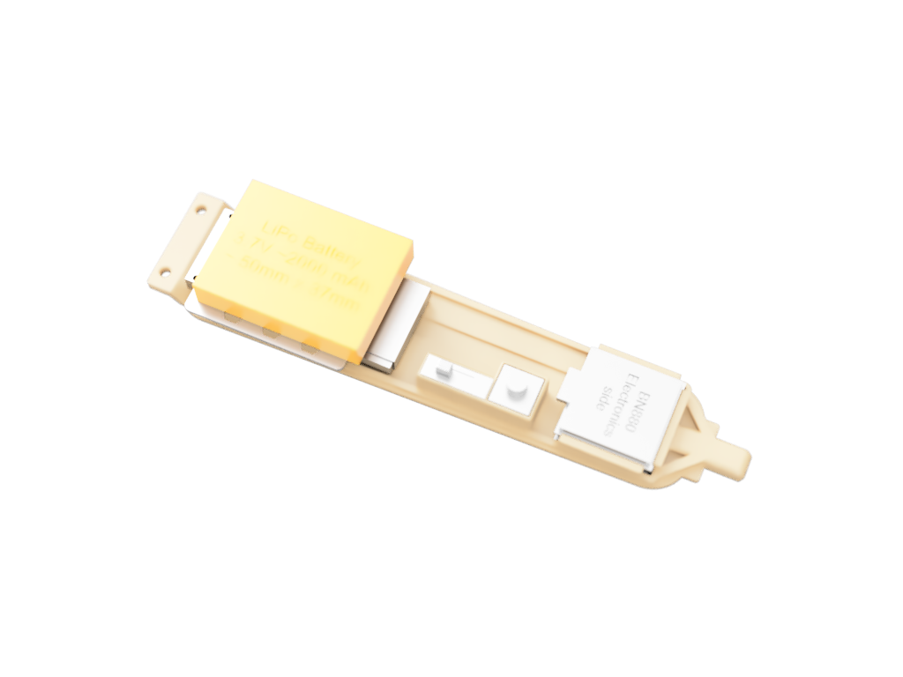
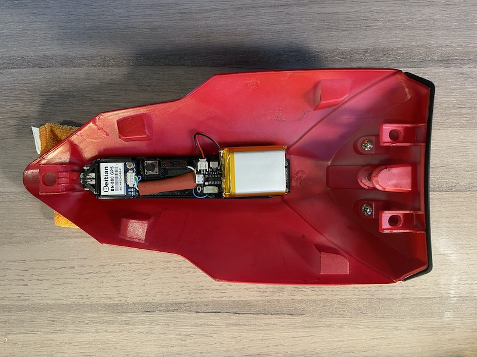
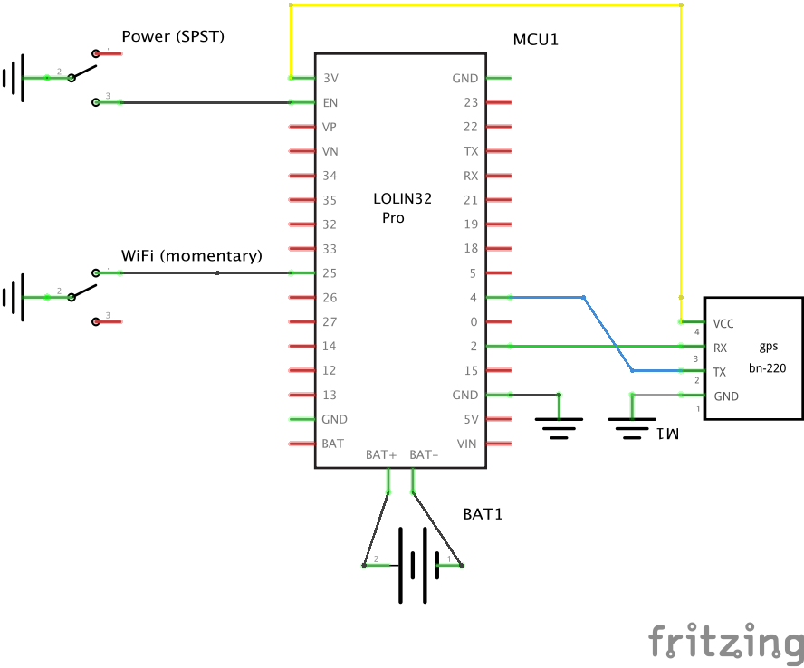
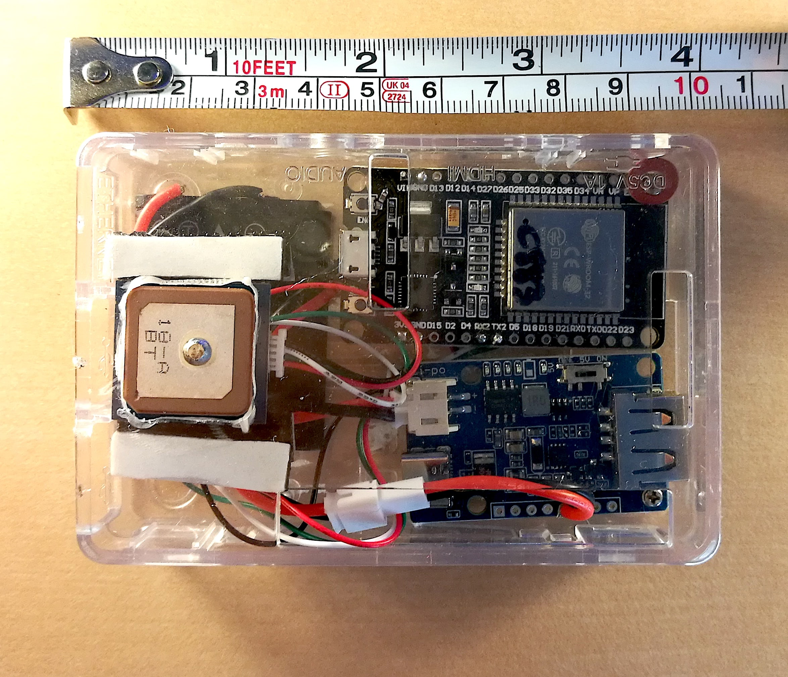
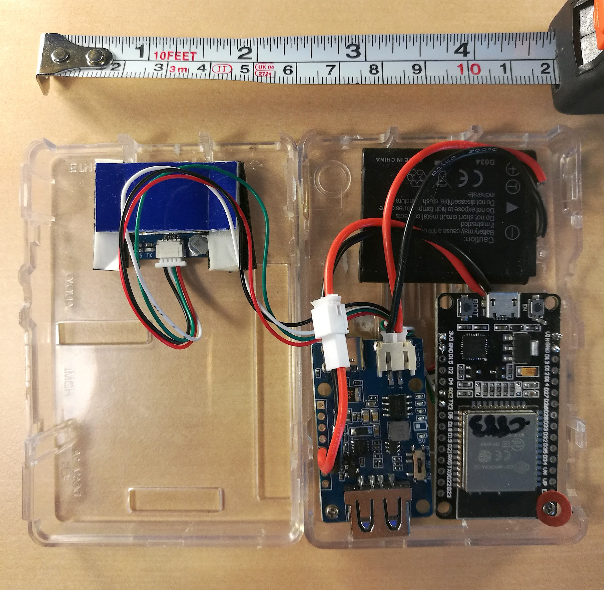
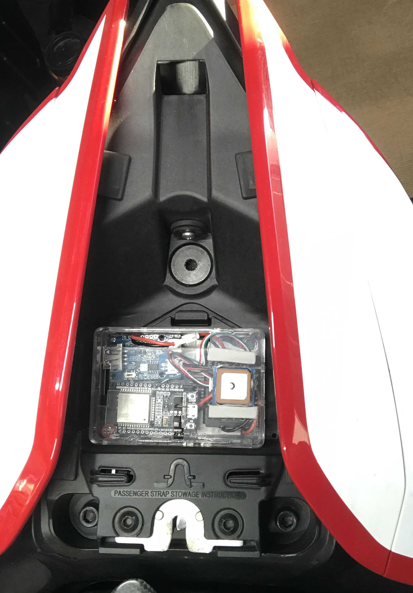

# A couple of working prototypes that don't look fancy but get the job done

- [A couple of working prototypes that don't look fancy but get the job done](#a-couple-of-working-prototypes-that-dont-look-fancy-but-get-the-job-done)
  - [Integrated in seat cowl (with BN880) of a Ducati Panigale 959 with 3D printed base](#integrated-in-seat-cowl-with-bn880-of-a-ducati-panigale-959-with-3d-printed-base)
    - [Rendering of 3D model](#rendering-of-3d-model)
    - [Picture of installed model](#picture-of-installed-model)
    - [3D printing](#3d-printing)
  - [Transparent case (with BN220)](#transparent-case-with-bn220)

Hardware is similar for both and it's mostly based on things I could easily find:

- basic [ESP32 DEVKIT](https://www.amazon.com/D-FLIFE-Development-Dual-Mode-Microcontroller-Integrated/dp/B08DR31G4G) board
- [BN880](https://www.amazon.com/Geekstory-Navigation-Raspberry-Aircraft-Controller/dp/B078Y6323W) (better as it has an active antenna) GPS or [BN220](https://www.amazon.com/Beitian-Navigation-Raspberry-Betaflight-Aircraft/dp/B07WM1GFY8) (cheaper)
- Li-Ion battery
- [JST2.0 cables](https://www.amazon.com/gp/product/B07NWD5NTN/ref=ppx_yo_dt_b_asin_title_o05_s00?ie=UTF8&psc=1) to connect battery to LiPo charger and LiPo charger to ESP32 power inputs (Vin, GND)

In one case, the unit is assembled within a left-over Raspberry Pi case (the transparent case helps in checking the light status) and a LiPo charger (Seeedstudio [LiPo Rider Plus](https://wiki.seeedstudio.com/Lipo-Rider-Plus/) charger - the first LiPo charger I found at MicroCenter while shopping, with a couple of nice features such as a fuel gauge)

A recommended and supported ESP32 board is [Wemos/LOLIN D32 Pro](https://www.wemos.cc/en/latest/d32/d32_pro.html) which has some benefits

- integrated LiPo charger
- more flash memory and PSRAM
- SD slot builtin

This software runs on it (be sure to select it within the Arduino IDE or to use the tasks named 'lolind32pro' within PlatformIO or to select the right definition in [include/bonogps_board_settings.h](include/bonogps_board_settings.h))

## Integrated in seat cowl (with BN880) of a Ducati Panigale 959 with 3D printed base

**⏱️ Time:** 3-4 hours (plus 12-15 hours for 3D printing) | **🎯 Difficulty:** Intermediate to Advanced | **Prerequisites:** Soldering skills, 3D printer access, basic electronics knowledge

The GPS antenna is underneath the very end of the tail, with minimal plastic over it and with the best clear line of sight of any other location on the bike.

A simple 3D printed board is used to hold all components in place

- GPS: BN880 or BK880 or BK280 (same form factor)
- ESP32: Lolin d32pro
- LiPo Battery (2000 mAh will last a full day of riding)
- A small on/off button
- A momentary button to serve as WiFi mode selection button (equivalent to BOOT on other ESP32 models)

Please note the battery holder is not stable, after several months of use it started randomly coming loose. A redesign of that part would be best.

### Rendering of 3D model

### Picture of installed model

### 3D printing

- [base board](bonogps_panigale_baseboard.stl)
- [battery slider](bonogps_panigale_battery_slider.stl)

If you have different components, [source files for Fusion 360 are also available](BonoGPS%20-%20Panigale%20899%201199%20959%201299.f3d).

Schematics are simple:

- a GPS serial connection TX+RX and its power
- a on/off switch that disables power to the internal Lolin D32 Pro regulator
- a momentary switch to act as WiFi mode selector, in lieu of a Boot button

Steps - [here a video of how all pieces fit together](959%20under%20tail%20v11.mp4)

- print the base board
- print the battery slider
- connect/solder the connector cables between ESP32 and GPS (4 wires): VCC to 3V, RX to pin 0, TX to pin 4, GND to GND
- connect/solder micro on/off switch and momentary button cables (leave cables open on the end towards ESP32) (3 wires). The on/off connects GND to EN pin or it leaves it open, the momentary button connects pin 25 to GND
- connect/solder the open end of cables for switches to ESP32
- mount the ESP32 in place with 3 small screws (I suggest M1.7)
- slide in BN880
- connect the BN880 with its connector
- use a zip tie or double sided tape or strong velcro to hold the battery on the battery slider
- carefully slide in the battery slider and make sure it holds its place: this is delicate so make sure you don't break the support structures
- connect the LiPo JST battery

.. and you are done! Don't forget you need to store a base configuration on your GPS before it's ready for use (check [GPS configuration](../GPS/README.md))

**See also:**
- [GPS Configuration Guide](../GPS) - **Critical:** Configure before first use
- [Software Build Guide](../../software/building) - Flash firmware to ESP32
- [Connecting Apps](../../software/connecting) - Link BonoGPS to lap timer apps

## Transparent case (with BN220)

**⏱️ Time:** 1-2 hours | **🎯 Difficulty:** Beginner | **Prerequisites:** Basic soldering, double-sided tape or velcro

A small 650mAh battery gives ~ 4 hrs of autonomy, I repurposed one that was supposed to be used for a digital camera

I used double sided tape to attach this on top of a back seat/seat cowl or to secure it inside the fairing: an example for a Ducati Panigale 959/1299 here below:

## Hardware Assembly Troubleshooting

### Wiring and Connection Issues

**Problem:** Device not powering on

**Solution:**
- Check battery voltage with multimeter (should be 3.7-4.2V for LiPo)
- Verify battery polarity (red=positive, black=negative)
- Test battery under load (weak batteries may show voltage but can't supply current)
- Check on/off switch connections (EN pin to GND = off, EN floating = on)
- For LOLIN D32 PRO: verify JST connector polarity matches board markings
- Try powering via USB to isolate battery/switch issues

**Problem:** ESP32 powers on but GPS doesn't work

**Solution:**
- Verify GPS power connections: VCC to 3.3V, GND to GND
- **Critical:** Do NOT connect GPS VCC to 5V - will damage GPS
- Check for loose connections in GPS connector
- Measure voltage at GPS VCC pin (should be 3.0-3.6V with GPS connected)
- If using dupont wires, ensure good mechanical connection (crimp quality)
- Solder connections preferred for reliability in vibration environment

**Problem:** Intermittent connection / Device works on bench but not when riding

**Solution:**
- Vibration from riding can loosen connections
- **Solder all critical connections** - do not rely on breadboard/dupont wires
- Add hot glue or strain relief to solder joints
- Secure GPS module with zip ties or mounting screws
- Check that wires aren't pulling on connections
- Consider using crimped JST/Molex connectors for removable connections

**Problem:** Wrong TX/RX connections

**Solution:**
- **Remember: TX → RX and RX → TX (crossed)**
- GPS TX (transmit) connects to ESP32 RX (receive)
- GPS RX (receive) connects to ESP32 TX (transmit)
- Common mistake: connecting TX to TX and RX to RX
- If no GPS data, try swapping TX/RX wires
- Double-check pinout diagram for your specific ESP32 board

### ESP32 Board Specific Issues

**Problem:** Generic ESP32 DevKit - which pins to use?

**Solution:**
- **UART2 default pins:**
  - RX2: GPIO16 (RX2)
  - TX2: GPIO17 (TX2)
- **Alternative if conflicts:**
  - Any GPIO can be used with Serial2.begin(baudrate, config, RX_pin, TX_pin)
  - Avoid: GPIO 6-11 (flash), GPIO 0 (boot), GPIO 2 (boot)
  - Good choices: GPIO 16, 17, 25, 26, 27, 32, 33
- Check `bonogps_board_settings.h` for configured pins
- Update code if using different pins

**Problem:** LOLIN D32 PRO specific issues

**Solution:**
- **No default Serial2 pins** - must be configured in code
- Default configuration uses:
  - RX2: GPIO4 (conflicts with SD card if used)
  - TX2: GPIO2
- **Battery not charging:**
  - Ensure LiPo battery has built-in protection circuit
  - Use 1S LiPo only (3.7V nominal)
  - Charging current: ~500mA via USB
- **No BOOT button:**
  - Must add external momentary button between GPIO25 and GND
  - Define `WIFI_MODE_BUTTON` in board settings
- See [LOLIN D32 PRO guide](../esp32/lolin_d32_pro.md) for complete wiring

**Problem:** ESP32 keeps resetting / Brown-out detected

**Solution:**
- Insufficient current from power source
- USB power: Some ports provide only 100mA (need 500mA+)
- Battery: Weak or depleted battery can't provide peak current
- GPS + ESP32 + WiFi/BT can draw 300-500mA peaks
- **Solutions:**
  - Use quality USB cable (charge cables, not data)
  - Use battery rated for at least 500mA continuous (1C for 500mAh+ battery)
  - Add 100-470µF capacitor near ESP32 power pins
  - Check for shorts in wiring
- Monitor serial output for brown-out messages

### Mounting and Installation Issues

**Problem:** GPS not getting fix when installed

**Solution:**
- Test GPS with device outside first (confirm GPS works)
- **Sky view critical** - GPS needs to "see" satellites
- Metal tank/fairing can block signal - test at intended location
- Carbon fiber is opaque to GPS signals
- Best locations on motorcycle:
  - Under seat cowl (transparent plastic above)
  - Top of tail section
  - Under gas tank cowl (only if plastic/fiberglass)
- Worst locations:
  - Under metal tank
  - Under carbon fiber bodywork
  - Inside metal case/box
- Use U-Center via TCP/IP to check signal strength at installation location

**Problem:** Device falls off / comes loose

**Solution:**
- Double-sided tape fails in heat and vibration
- Better options:
  - Velcro (industrial strength) - removable but secure
  - 3D printed mount with screws
  - Zip ties through fairing mounting holes
  - Adhesive-backed Velcro (3M brand)
- Clean mounting surface with isopropyl alcohol before applying adhesive
- Allow adhesive to cure 24 hours before riding
- Test security by pulling firmly before first ride

**Problem:** Battery life shorter than expected

**Solution:**
- **Calculate runtime:** Battery_mAh / Current_mA = Hours
- Example: 650mAh / 300mA average = 2.1 hours
- Current draw varies:
  - ESP32: 80-160mA (depends on WiFi/BT use)
  - GPS: 30-80mA (depends on module and fix status)
  - LEDs: 10-40mA
  - **Total typical: 250-350mA**
- **To extend runtime:**
  - Use larger battery (2000mAh+ for full day)
  - Disable WiFi when not needed
  - Use power saving GPS modes between sessions
  - Disable unused features (BLE or BT-SPP if not needed)
  - Turn off external LEDs
- Check for battery degradation (old batteries lose capacity)

### Switch and Button Issues

**Problem:** On/off switch not working

**Solution:**
- Verify switch is in series with power (typically between battery+ and EN pin)
- LOLIN D32 PRO: Switch connects EN to GND (pulled low = off)
- Check switch orientation - may be backwards
- Use multimeter continuity mode to verify switch operation
- Poor quality switches can have intermittent contact

**Problem:** WiFi mode button (BOOT) not responding

**Solution:**
- Short press (< 500ms) should toggle WiFi AP on/off
- Long press (> 2 seconds) should enable WiFi Client
- Check button is momentary (not latching)
- Verify button connects GPIO to GND (not GPIO to 3.3V)
- May need pull-up resistor if using long wires (10kΩ to 3.3V)
- Check `WIFI_MODE_BUTTON` definition matches your wiring
- Test button with multimeter in continuity mode

### LED Indicator Issues

**Problem:** Built-in LED not working or showing wrong pattern

**Solution:**
- Different ESP32 boards use different pins for LED
- Common LED pins: GPIO2 (DOIT), GPIO5 (LOLIN D32 PRO has RGB)
- Check your board schematic for LED pin
- **LED patterns:**
  - Slow blink (500ms): WiFi AP mode
  - Fast blink (250ms): WiFi Client mode
  - Solid/Off: WiFi disabled or wrong LED pin configured
- Some boards have inverted LED logic (LOW=on, HIGH=off)

**Problem:** External LED not working

**Solution:**
- Verify LED polarity (long leg = anode/positive, short leg = cathode/negative)
- **Typical wiring:** GPIO → Resistor → LED anode, LED cathode → GND
- Calculate resistor: R = (3.3V - LED_Vf) / LED_I
  - Red LED: (3.3-2.0)/0.020 = 65Ω (use 47-100Ω)
  - Blue/White LED: (3.3-3.0)/0.020 = 15Ω (use 22-47Ω)
- Test LED with multimeter in diode test mode
- Check GPIO pin definitions in `bonogps_board_settings.h`

### Enclosure and Environmental Issues

**Problem:** Device overheats in enclosure

**Solution:**
- ESP32 generates heat, especially with WiFi enabled
- Ensure ventilation in enclosure
- Avoid direct sunlight on enclosed device
- Consider heatsink on ESP32 module if in sealed enclosure
- LOLIN D32 PRO may get warm when charging - this is normal

**Problem:** Water/moisture damage

**Solution:**
- Most ESP32 boards are not waterproof
- Use conformal coating on PCB for moisture protection
- Silicone conformal coating spray (MG Chemicals 422B)
- Do not coat connectors or switches
- For rain riding: use waterproof enclosure with IP65+ rating
- Add desiccant pack inside sealed enclosures
- USB port is vulnerable - use dust cap when not in use

**Problem:** GPS performance degraded after installation

**Solution:**
- Antenna may be too close to metal
- Electrical noise from ignition/alternator can interfere
- Keep GPS away from:
  - Ignition coils (15+ cm minimum)
  - Alternator/stator
  - Power cables
  - Phone/RF transmitters
- Add ferrite bead on GPS power cable if noise suspected
- Test by powering from separate battery (isolate from vehicle electrical)

### Testing and Validation

**Problem:** How to test assembled device before installation?

**Checklist:**
1. ✅ Power on test (ESP32 boots, LED visible)
2. ✅ WiFi test (can connect to BonoGPS-XXXX AP)
3. ✅ Web interface test (can access http://10.0.0.1)
4. ✅ GPS test (place outside, wait for fix, check LED)
5. ✅ App connection test (connect phone app, verify data)
6. ✅ Button test (verify WiFi mode switching)
7. ✅ Battery test (fully charge, verify runtime)
8. ✅ Vibration test (shake device, check for loose connections)
9. ✅ Heat test (run for 30+ minutes, check for overheating)

**Problem:** Device works with USB but not with battery

**Solution:**
- USB provides regulated 5V, battery provides variable 3.3-4.2V
- Check if ESP32 has voltage regulator (most do)
- Verify battery is charged (> 3.6V under load)
- Check battery current capacity (need 500mA+)
- Test battery with multimeter under load
- Some ESP32 clones have poor quality regulators
- May need external LDO regulator for stable operation

### Getting Help with Assembly Issues

If you're stuck:
1. Take clear photos of your wiring
2. Measure voltages at key points with multimeter
3. Test components individually (GPS with U-Center, ESP32 with simple sketch)
4. Post in [GitHub Discussions](https://github.com/renatobo/bonogps/discussions) with:
   - Your ESP32 board model
   - GPS module model
   - Wiring diagram or photos
   - What works and what doesn't
   - Any error messages from serial monitor
