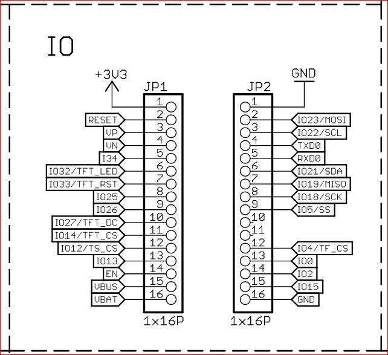

# LOLIN D32 PRO

- [No BOOT Button](#no-boot-button)
- [Serial2 PINs need to be assigned](#serial2-pins-need-to-be-assigned)
- [Battery monitoring](#battery-monitoring)
- [Turning on and off when on a battery](#turning-on-and-off-when-on-a-battery)
- [External leds for WiFi and Active](#external-leds-for-wifi-and-active)
- [Complete example schematic](#complete-example-schematic)

## No BOOT Button

You need to supply an external temporary button to enable the WiFi switching option that the builtin BOOT button provides on the DevKit board.

Its pin is defined in `include/bonogps_board_settings.h` as  `WIFI_MODE_BUTTON`

## Serial2 PINs need to be assigned

This board does not have dedicated definitions for Serial2, so you need to pick a couple of PINs and assign them to the TX/RX function.

These pins need to be defined in `include/bonogps_board_settings.h` as `RX2` and `TX2`

The recommended options (defined in `bonogps_board_settings`) are

- RX2 -> GPIO_NUM_4 (aka IO4, pin 12)
- TX2 -> GPIO_NUM_2 (aka IO2, pin 14)



Note: IO4 is used by the SD Card, so this might have to be changed if you use it.

## Battery monitoring

`GPIO_35`  provides Battery voltage with an A2D conversion (check this [tutorial](https://www.youtube.com/watch?t=88&v=yZjpYmWVLh8&feature=youtu.be)).

This replicates the functionality of *battery fuel gauge* available on the [Lipo Rider Plus](https://wiki.seeedstudio.com/Lipo-Rider-Plus/https://wiki.seeedstudio.com/Lipo-Rider-Plus/), but printed directly on the header of the main page of the web configuration interface.


This is the simple function used to collect voltage

```C
analogRead(GPIO_BATTERY) / 4096.0 * 7.445
```

Percentage is based on the common LiPo values as charged by its [TP4054](https://datasheetspdf.com/pdf/1090540/NanJingTopPower/TP4054/1): linear scale from 3.3V (0%) to 4.2V (100%).

These are enabled by the preprocessing macro `SHOWBATTERY`

## Turning on and off when on a battery

Since the battery is always attached, the easiest option is to use the `EN` pin by tying it to the ground. This disables the onboard voltage regulator ME6211 (check [schematics](https://www.wemos.cc/en/latest/_static/files/sch_d32_pro_v2.0.0.pdf))

## External leds for WiFi and Active

If you fully enclose your device, you should have external LED's so show that the device is on and what type of WiFi mode.

- pick a low power led (e.g. a 3mm red or yellow)
- compute what resistance you need (suggested: [Led Calculator](https://www.hobby-hour.com/electronics/ledcalc.php))

Now let bonogps know using these macros

- `LED_ACTIVE_EXTERNAL` : define it to the pin where the Active LED is connected
- `LED_WIFI` : define it to the pin where the Active LED is connected

## Complete example schematic

Considering

- `LED_ACTIVE_EXTERNAL` defined as `GPIO_NUM_14`, with led at 20 mA so closest resistor off the shelf is 47 Ohm
- `LED_WIFI` defined as `GPIO_NUM_12`, with led at 20 mA so closest resistor off the shelf is 47 Ohm
- `WIFI_MODE_BUTTON` defined as `GPIO_NUM_25`, with temporary switch
- external On/Off locking switch
- LiPo battery

This is how the schematics looks like


BN-220 is shown, but it doesn not matter - it could be any of the supported ones.

[Fritzing source file](lolin_d32_pro.fzz)