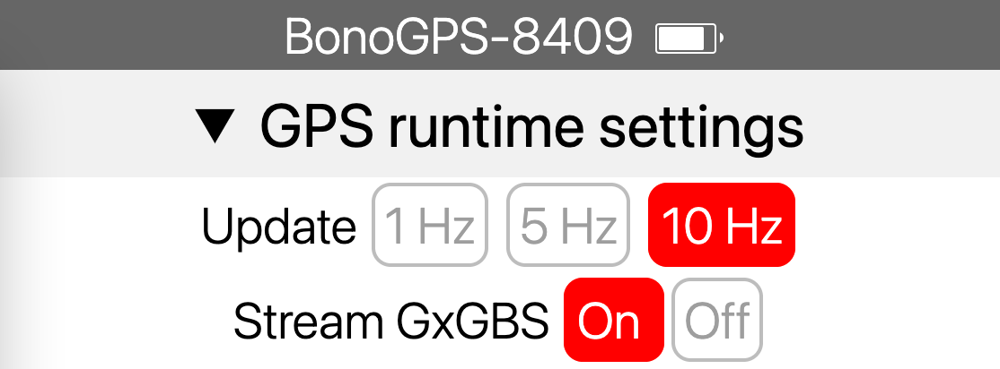

# LOLIN D32 PRO

- [No BOOT Button](#no-boot-button)
- [Serial2 PINs need to be assigned](#serial2-pins-need-to-be-assigned)
- [Battery monitoring](#battery-monitoring)

## No BOOT Button

You need to supply an external temporary button to enable the WiFi switching option that the builtin BOOT button provides on the DevKit board.

Its pin is defined in `include/bonogps_board_settings.h` as  `WIFI_MODE_BUTTON`

## Serial2 PINs need to be assigned

This board does not have dedicated definitions for Serial2, so you need to pick a couple of PINs and assign them to the TX/RX function.

These pins need to be defined in `include/bonogps_board_settings.h` as `RX2` and `TX2`

## Battery monitoring

`GPIO_35`  provides Battery voltage with an A2D conversion (check this [tutorial](https://www.youtube.com/watch?t=88&v=yZjpYmWVLh8&feature=youtu.be)).

This replicates the functionality of *battery fuel gauge* available on the [Lipo Rider Plus](https://wiki.seeedstudio.com/Lipo-Rider-Plus/https://wiki.seeedstudio.com/Lipo-Rider-Plus/), but printed directly on the header of the main page of the web configuration interface.



This is the simple function used to collect voltage

```C
analogRead(GPIO_BATTERY) / 4096.0 * 7.445
```

Percentage is based on the common LiPo values as charged by its [TP4054](https://datasheetspdf.com/pdf/1090540/NanJingTopPower/TP4054/1): linear scale from 3.3V (0%) to 4.2V (100%).

These are enabled by the preprocessing macro `SHOWBATTERY`
