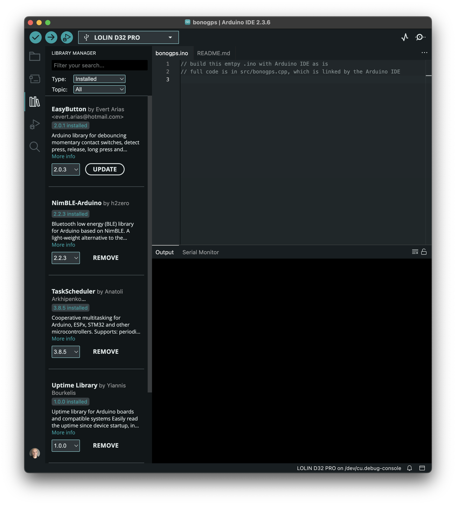
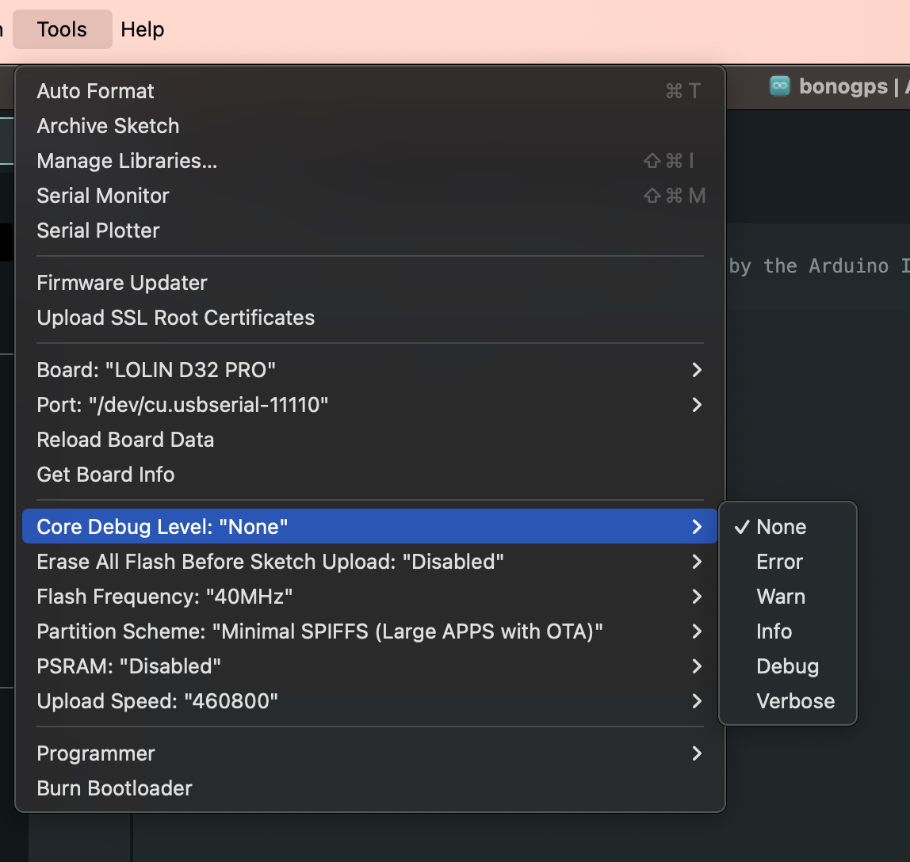

# Software development and build

- [Software development and build](#software-development-and-build)
  - [IDE options/suggestions: Arduino IDE or VS Code+Platformio](#ide-optionssuggestions-arduino-ide-or-vs-codeplatformio)
    - [Arduino IDE (recommended if you are new to the 'maker' approach)](#arduino-ide-recommended-if-you-are-new-to-the-maker-approach)
    - [PlatformIO](#platformio)
  - [Libraries](#libraries)
    - [External Libraries](#external-libraries)
    - [Built-in libraries](#built-in-libraries)
  - [Build options](#build-options)
    - [Large use of preprocessing macro](#large-use-of-preprocessing-macro)
    - [Logging facilities](#logging-facilities)
    - [How to enable OTA build](#how-to-enable-ota-build)
      - [OTA on Arduino IDE](#ota-on-arduino-ide)
      - [OTA on PlatformIO](#ota-on-platformio)
    - [Important: Partition size](#important-partition-size)

## IDE options/suggestions: Arduino IDE or VS Code+Platformio

Development is active on the [VS Code + Platformio](https://platformio.org/install/ide?install=vscode) combination: you can download the complete repository and work directly.

### Arduino IDE (recommended if you are new to the 'maker' approach)

Code is written to be compatible with the Arduino IDE, there are a couple of steps required, starting from the assumption that you have already installed and set up the Arduino IDE for ESP32

- install the 'External libraries' listed in the section [deps] entry `lib_deps` of `platform.ini`. See below an example of how and when to select a specific version
- open the `bonogps.ino` file: it's empty as all in the code is somewhere else
- choose your board: "ESP32 Dev Module" (the generic board that everyone has, often tagged DOIT) or ["LOLIN D32 PRO" are supported](hardware/esp32/lolin_d32_pro.md), otherwise you might have to redefine your pins in `bonogps_board_settings.h`
- choose a partition schema with enough space (e.g. the Minimal SPIFSS with 1.9Mb of flash space)

The rest is common to any other build on the Arduino IDE.

IF you are unsure of what board you are running, [check this introductory tutorial](https://randomnerdtutorials.com/getting-started-with-esp32/).

You can update software OTA, check a later paragraph here on how, as it's not enabled by default.

### PlatformIO

Beside install PlatformIO (on VS Code as a recommendation), the build system uses a custom **python** script to determine the current software release version: `git_rev_macro.py` and it expects the project folder to be downloaded from github directly to build up the `GIT_REV` and `GIT_REPO` macro variables correctly.

If you are having issues, you can remove the line that invokes `git_rev_macro.py` and optionally set the 2 macros `GIT_REV` and `GIT_REPO` manually.

If you would like to define custom targets for your build, I recommend using a `platformio_custom.ini` file (there is a template in `platformio_custom.ini.template`).

## Libraries

### External Libraries

- [NimBLE-Arduino](https://github.com/h2zero/NimBLE-Arduino) from version 2.X
- [Uptime Library](https://github.com/YiannisBourkelis/Uptime-Library)
- [EasyButton](https://easybtn.earias.me/) specifically version 2.0.1: do not use any other version. This feature will be migrated to another library, as EasyButton is no longer developed and the latest version is not working
- [Task Scheduler](https://github.com/arkhipenko/TaskScheduler) 

On Arduino this would look like 

### Built-in libraries

Always included

- WebServer
- FS
- Preferences
- WiFi
- DNSServer
- ESPmDNS
- Update
- BluetoothSerial

Included via `#define` statements or compile macros

- ArduinoOTA: this really depends on how you prefer to update software on your device. It adds size to the flash, and it uses some memory, so if you don't plan on using it, don't include it.

## Build options

### Large use of preprocessing macro

To keep flash size small and to avoid several versions of the software, almost all features are enabled/disabled via macro preprocessing

For example, if you don't need BT-SPP or BLE, you can remove them. The most important ones are

- `BTSPPENABLED` Include BT-SPP capabilities (default: enabled)
- `BLEENABLED` Include BLE capabilities (default: enabled)
- `ENABLE_OTA` Include OTA capabilities (default: disabled)
- `SHOWBATTERY` Display battery status for boards that have built-in (like [LOLIN D32 PRO](../hardware/esp32/lolin_d32_pro.md)])

### Logging facilities

All logging on Serial Port is managed with `log_<i/d/e/w>()` functions (read more at [ESP32 Logging](https://thingpulse.com/esp32-logging/)). You can control how much logging is enabled within the Arduino IDE from the `Tools > Core Debug Level` menu.



### How to enable OTA build

OTA libraries are not enabled by default, to keep the binary size smaller and to have less software running at all times (it's a miracle there are no RAM issues with all tasks running).

Since updating via OTA is extremely convenient when you are testing, here is how to activate it via two preprocessing macro variables

- `ENABLE_OTA` if defined, libraries and code are built in, if undefined,d no OTA is included
- `OTA_AVAILABILITY_SECS` defines for how long OTA is available after boot, either `-1` (forever) or a finite number of seconds. If undefined, it's `300`, to avoid any mistake on the field where you might mistakenly start flashing a firmware you are actually using

#### OTA on Arduino IDE

- uncomment `// #define ENABLE_OTA` at the beginning of `src/bonogps.cpp` (which you might have renamed to `bonogps.ino`)
- optionally, change for how long OTA is available defining `OTA_AVAILABILITY_SECS`

#### OTA on PlatformIO

- There are a couple of build targets ending in `_ota` that contain the command line define statements. If you need more build targets, I recommend using a local `platformio_custom.ini` that is not synced with the git repository
- you can also permanently enable it by changing the source code, as for the Arduino case (not recommended)

### Important: Partition size

You have to select a partitioning schema with 1.7 Mb of programming space (e.g. Minimal SPIFF with 1.9Mb), as the app with its libraries tends to be pretty large due to BT stacks.

Within PlatformIO, use the [platformio.ini](platformio.ini) available configuration

```ini
board_build.partitions = min_spiffs.csv
```

Within the Arduino IDE, from `Tools > Partition Scheme`


