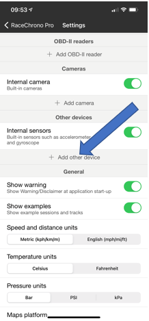
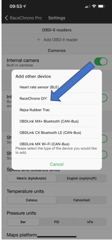
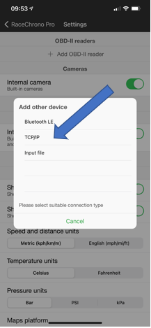
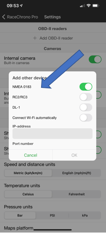
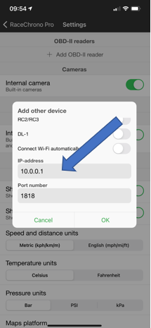

# RaceChrono

- [RaceChrono](#racechrono)
  - [Setup over BT-SPP on Android](#setup-over-bt-spp-on-android)
  - [Setup over Wifi on iOS](#setup-over-wifi-on-ios)
  - [GPS configuration for NMEA messages](#gps-configuration-for-nmea-messages)

The lap timer with the cleanest UX currently supported: [https://racechrono.com/](https://racechrono.com/)

- tested with v7.0.10 free (thus satellites view untested) on Android
- BT-SPP on Android
- TCP-IP for iOS
- GSA+GSV polling at 5 sec

## Setup over BT-SPP on Android

Open settings from the gear icon in the main page, then add a bluetooth receiver selecting your BonoGPS unit

When you start recording (the round big "start" button) if everything goes well you'll be able to see the constellations of satellites in the dashboard view

When you click on the lower left green "swipe up" icon, you'll be able to see further information about the GPS status

## Setup over Wifi on iOS

Make sure you have connected your iPhone to the AP on the BonoGPS device as you would to perfrom the setup

Open settings from the gear icon in the main page, then add an Internal sensor

Select "RaceChrono DIY" as the next option 

Under the "Add other device" select TCP/IP 

This next section requires several selections, step 1, enable the "NMEA 0183" slider 

On the same page as above now set you target IP address and port, the default is show below but if you have changed the network and the port in the code please put the updated values in. 

When you start recording (the round big "start" button) if everything goes well you'll be able to see the constellations of satellites in the dashboard view

When you click on the lower left green "swipe up" icon, you'll be able to see further information about the GPS status

## GPS configuration for NMEA messages

Instructions directly from the SW Developer of RaceChrono in the support forum point out [here](https://racechrono.com/forum/discussion/comment/11252/#Comment_11252) and [here](https://racechrono.com/forum/discussion/1421/best-settings-for-qstarz818xt)

- Sentences need to start with `$GP`
- Only `GGA+RMC` or `RMC+VTG+ZDA` combinations are used
- `GSA+GSV` are optional
- `GBS` sentence is not used

This means

- Main Talker ID = GP
- `GSA` and `GSV` every 5 seconds, with only `GSV` restricted to GP