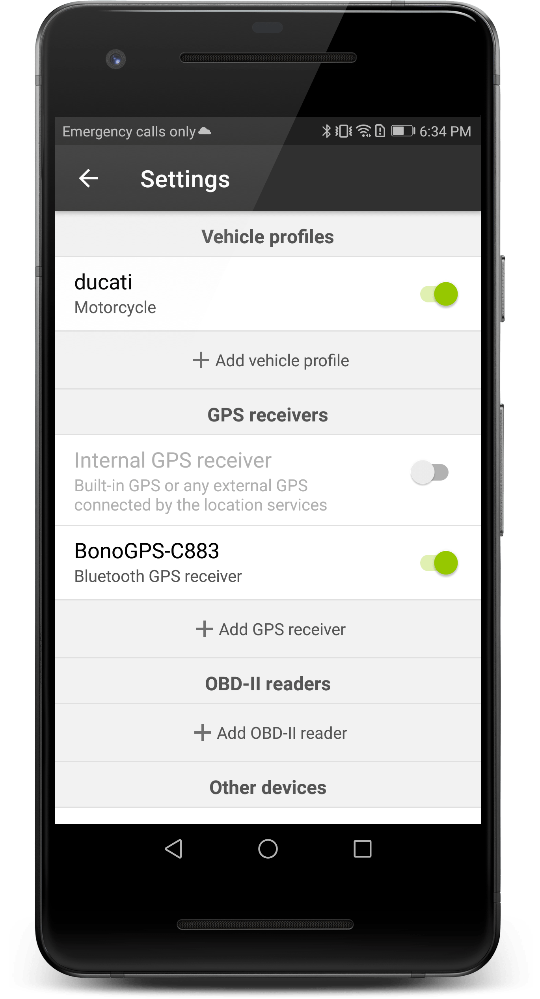
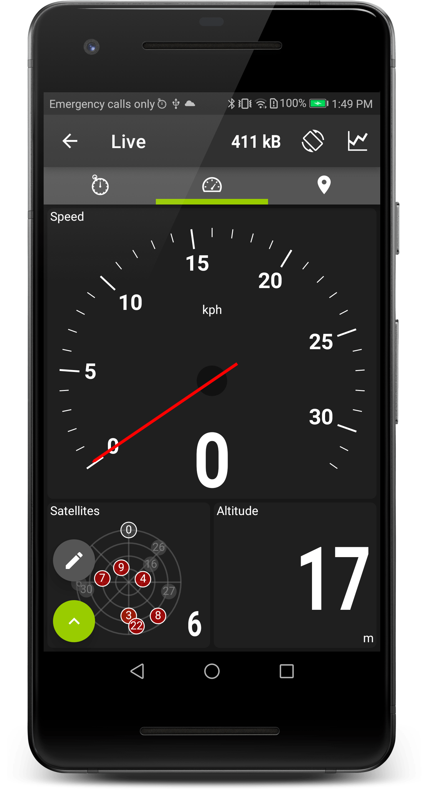
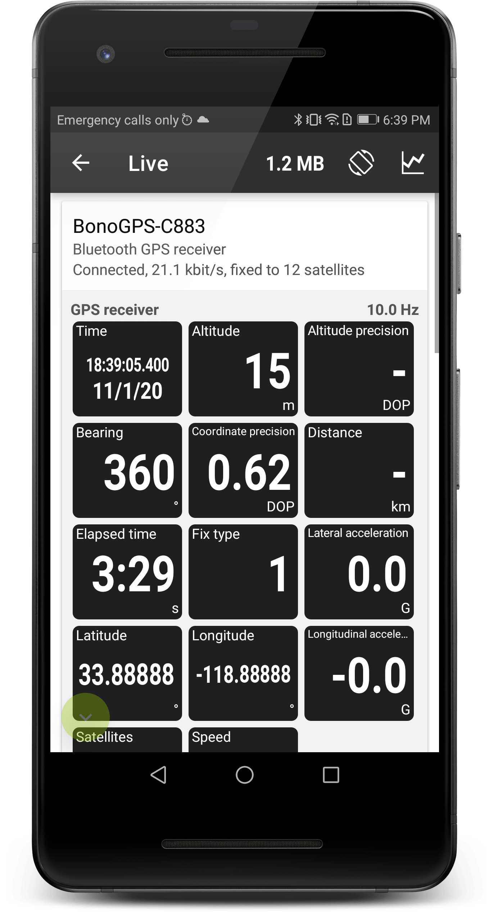

# RaceChrono

The cleanest and simplest lap timer supported: [https://racechrono.com/](https://racechrono.com/)

  - tested with v7.0.10 free (thus satellites view untested) on Android
  - BT-SPP is the only option
  - GSA+GSV polling at 1 sec

  
## Setup

Open settings from the gear icon in the main page, then add a bluetooth receiver selecting your BonoGPS unit

When you start recording (the round big "start" button) if everything goes well you'll be able to see the constellations of satellites in the dashboard view

When you click on the lower left green "swipe up" icon, you'll be able to see further information about the GPS status

