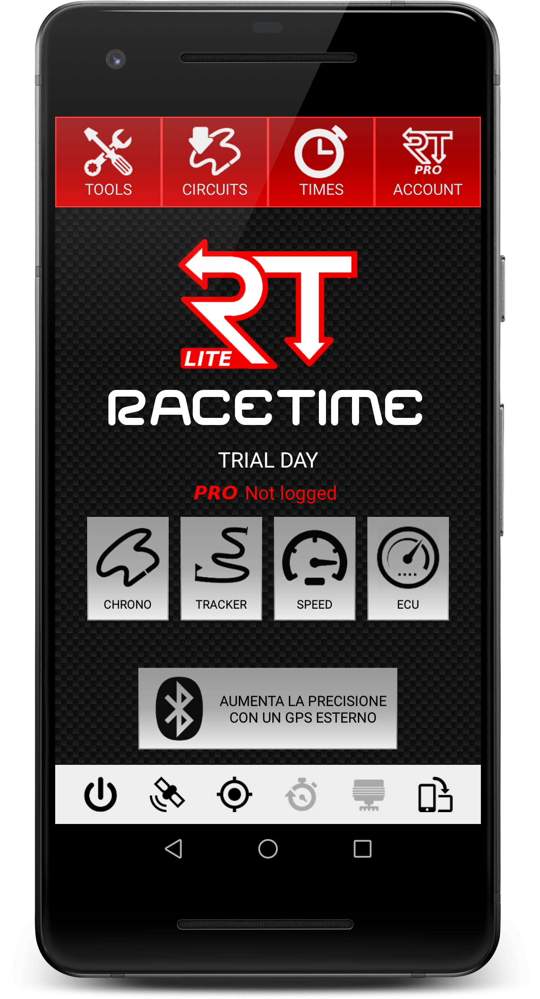
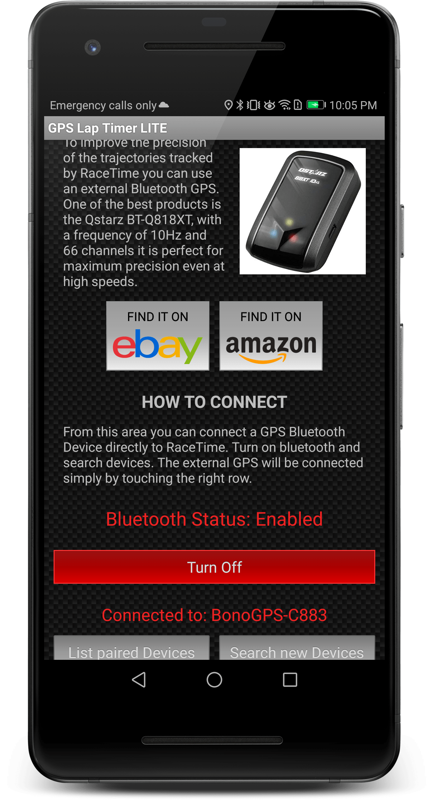
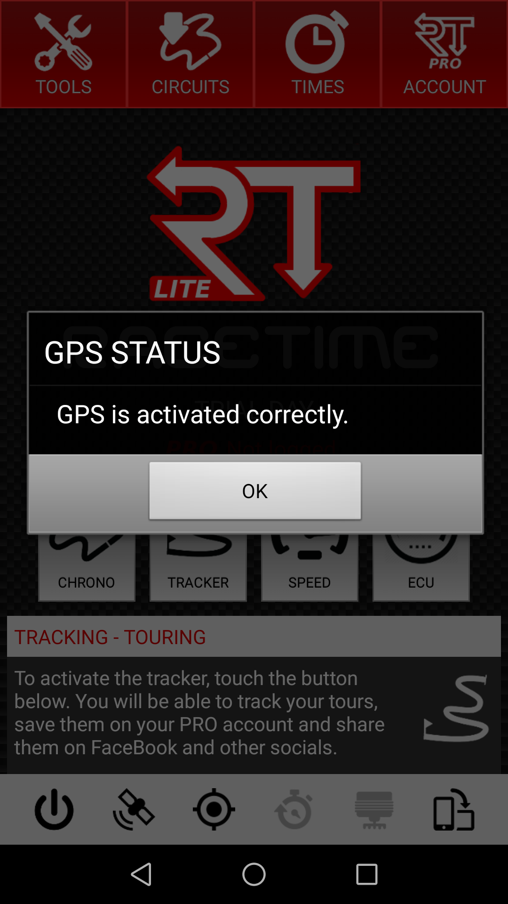
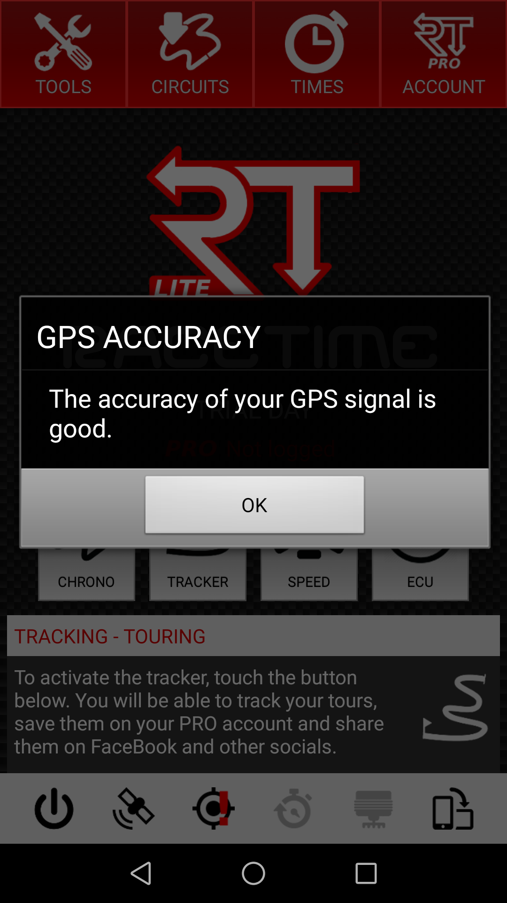

# Racetime

Latest supported app: [https://www.racetimeapp.com/en/](https://www.racetimeapp.com/en/)

  - tested with v3.3.8 lite
  - BT-SPP is the only option
  - `GPGGA`, `GPRMC`, `GPVTG`, `GPGLL` enabled, with main talker id GP

## Setup

Open the app, an icon to connect an external bluetooth adapter is displayed

From the connection page, search your device

When activated, the satellite icon lets you check the connection to the device

The location icon lets you check the quality of signal, showing a red exclamation point if something is not in place correctly

## GPS Configuration for NMEA messages

According to information shared via email with the developer Roberto Morini, RaceTime supports

* `GPGSA`
* `GPGGA`
* `GPRMC`
* `GPVTG`
* `GPGLL`

which means we have to enable the _Main Talker id = GP_ option.
As there is no display of satellite positions, `GPGSA` is not enabled.