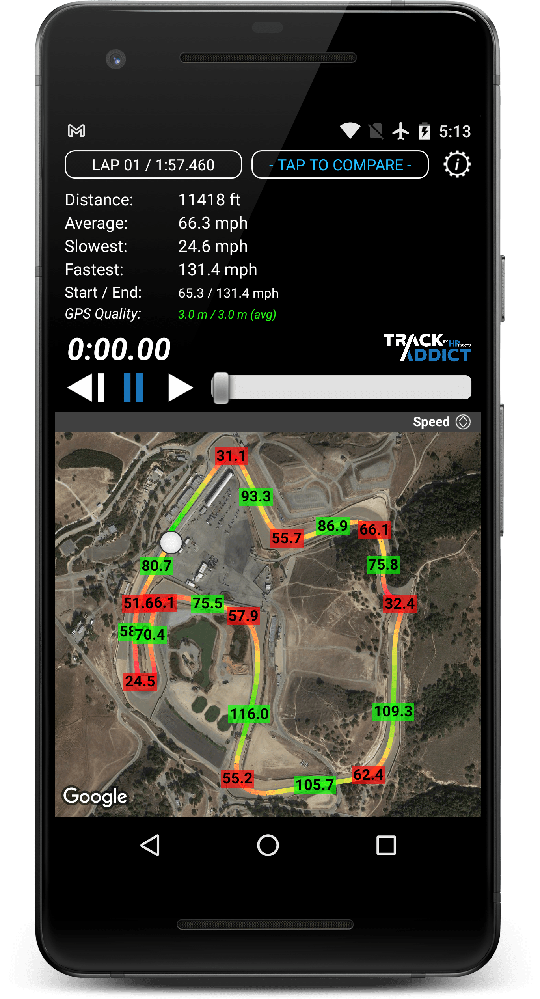
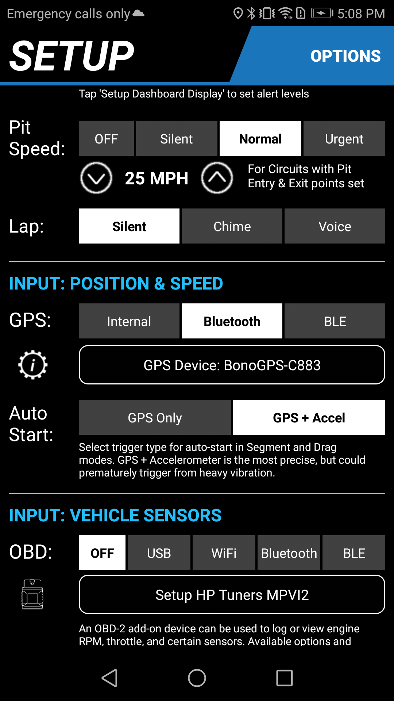
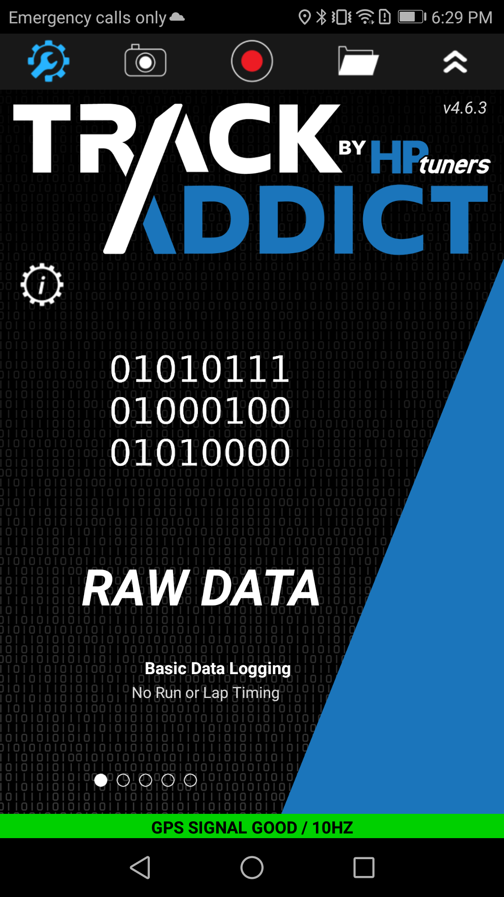
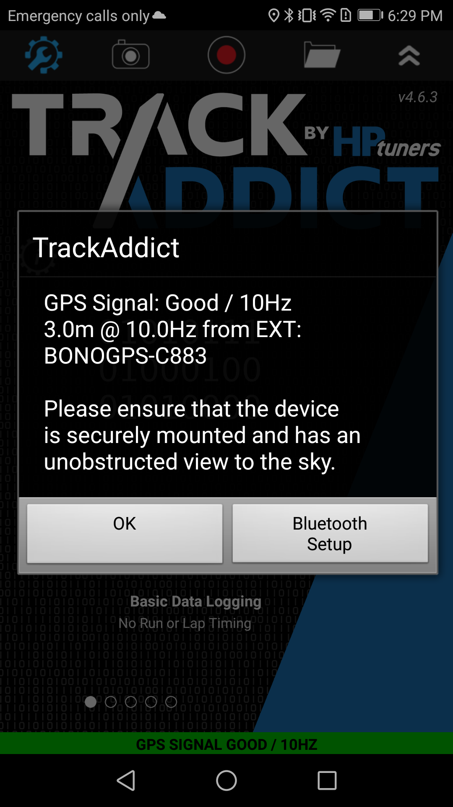

# TrackAddict

- [Configuration](#configuration)
- [GPS Configuration for NMEA messages](#gps-configuration-for-nmea-messages)

Another very popular app, [https://www.hptuners.com/product/trackaddict-app/](https://www.hptuners.com/product/trackaddict-app/)

- tested with v4.6.0 on Android
- BT-SPP is the only option
- it needs a specific set of NMEA messages configurations
- NBP was coded, yet not going to matter for TrackAddict as reported in [the forum](https://forum.hptuners.com/showthread.php?78403-GPS-over-NBP&highlight=gps)  

Please make sure that your BonoGPS unit is connected before recording a session, it will default back to internal GPS without informing you otherwise in a clear way.

## Configuration

In the main page, click on the gear icon, scroll down to "Input position and speed" and select Bluetooth GPS

Assuming everything well, the main page will now show the new refreshed rate of your BonoGPS unit

You can click on the green line at the bottom to find out more and validate the connection parameters

Once you have setup a connection, remember to check you are using the external GPS when starting the recording of your session

## GPS Configuration for NMEA messages

> Track Addict is similarly configured to only accept NMEA messages with a GPS talker ID (i.e., `GPRMC` instead of `GNRMC`) [as discussed in the forum](https://forum.hptuners.com/showthread.php?69123-Track-addict-external-GPS&highlight=gps)
> Ideally, TrackAddict wants `GPRMC`, `GPGGA`, and `GPGLL` messages, with `GPRMC` and `GPGGA` being the recommended minimum.

These messages are enabled

- `GPGGA`
- `GPRMC`
- `GPGLL`

The _Main Talker id = GP_ option is required.
